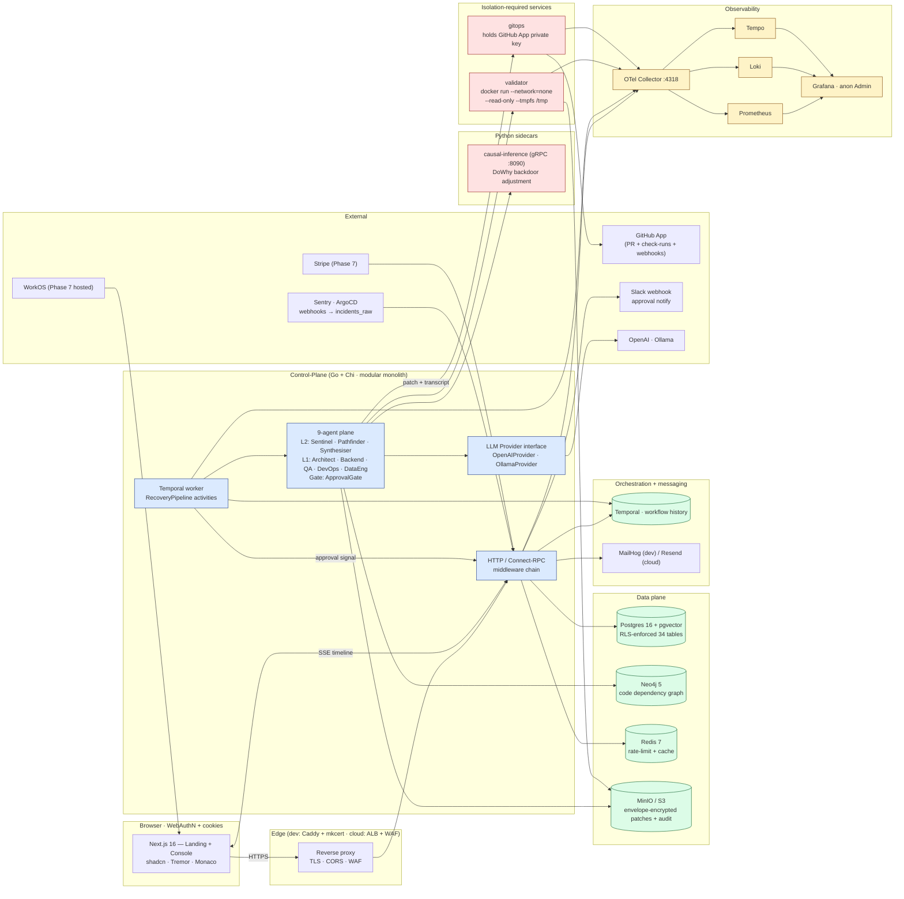
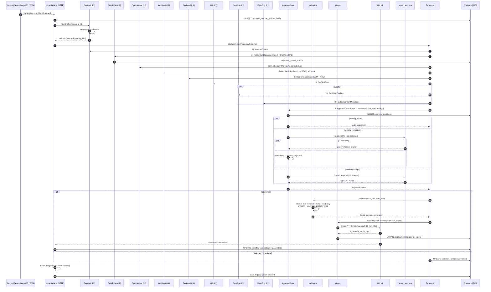

# NEXIS — Project Structure & System Overview

**Repo root:** `/Users/ratulsikder/PROJECTS/NEXIS_ECO/web_app`
**Status:** Phases 1 → 8 shipped on `main` (2026-05-13). 34 tables, 9 agents, 4 backend services, 1 frontend.
**Domain:** Multi-tenant SaaS for autonomous fault recovery — agentic incident-response pipeline (detect → diagnose → patch → validate → approve → deploy) gated by a human approval policy.

---

## 1. Top-Level Layout

```text
web_app/
├── apps/
│   ├── web/                  # Next.js 16.2.2 — landing + console (LIGHT default + dark toggle)
│   └── docs/                 # Nextra docs sub-app (Phase 8)
├── services/
│   ├── control-plane/        # Go 1.22 + Chi — modular monolith (API + 9-agent plane + Temporal worker)
│   ├── validator/            # Go — sandbox dispatcher (docker run --network=none --read-only)
│   ├── gitops/               # Go — GitHub App PR handler (holds the App private key)
│   └── causal-inference/     # Python sidecar — DoWhy + gRPC at :8090
├── packages/
│   ├── db/                   # Drizzle schema + migrations (TS, for /apps/web)
│   └── ui/                   # shadcn/ui primitives + Tremor + Monaco glue
├── infra/
│   ├── postgres/             # init + role grants (nexis, nexis_app, nexis_gitops)
│   ├── observability/        # Grafana + Loki + Tempo + Prometheus + OTel collector
│   ├── betterstack/          # public status page wiring
│   ├── tls/                  # mkcert CA + caddy for *.nexis.local
│   └── terraform/            # Phase 7 AWS IaC (planned)
├── secrets/github-app.pem    # GitHub App private key — bind-mounted into gitops only
├── docker-compose.yml        # 16 services, dev parity with cloud target
├── pnpm-workspace.yaml       # monorepo workspaces
├── turbo.json                # cache + pipeline
└── docs/                     # PROJECT_PLAN.md (locked spec) + this overview
```

### Backend (`services/control-plane`) — internal layering

Layering is enforced by `go-arch-lint`. Boundaries:

```text
internal/
├── domain/         # pure types + ports.go (interfaces). Zero infra deps.
├── usecase/        # application logic; orchestrates domain ports
├── adapter/        # implementations of domain ports
│   ├── llm/        # OpenAI + Ollama providers (Provider interface)
│   ├── agents/     # Architect / Backend / QA / DevOps / DataEng + Sentinel/Pathfinder/Synthesiser
│   ├── repo/       # sqlc-backed Postgres repos
│   ├── workflow/   # Temporal client wrappers
│   ├── validator/  # validator HTTP client
│   ├── approval/   # severity router + Slack notifier
│   ├── graphstore/ # Neo4j (Pathfinder)
│   ├── causal/     # gRPC client to Python DoWhy sidecar
│   ├── patchstore/ # MinIO/S3 envelope-encrypted patches
│   ├── secrets/    # KMS envelope encryption (LocalKeyVault in dev)
│   ├── retrieval/  # pgvector RAG
│   ├── notifier/   # Slack + email
│   └── billing/    # Stripe (Phase 7 gated)
├── transport/      # http handlers, middlewares, SSE bridges, gen/proto
├── platform/       # cross-cutting infra: db, config, OTel, crypto, auth
├── sentinel/       # streaming anomaly detector (Sentry + OTel windows)
└── workflow/recovery/  # Temporal `RecoveryPipeline` workflow + 9 activities
```

The 9-agent plane lives **inside a single Go binary** (control-plane), deliberately — solo-dev call documented in `docs/PROJECT_PLAN.md §2.1`. Validator + GitOps are split out only because each has a non-negotiable security boundary (sandbox-escape blast radius; GitHub App private-key surface).

---

## 2. Database ERD (core 34 tables, grouped by phase)

```mermaid
erDiagram
    organizations ||--o{ users : "owner_user_id"
    organizations ||--o{ org_members : "has"
    users ||--o{ org_members : "joined via"
    organizations ||--o{ workspaces : "owns"
    organizations ||--o{ sessions : "scoped to"
    users ||--o{ sessions : "has"
    users ||--o{ magic_tokens : "verifies via"
    organizations ||--o{ api_keys : "issues"
    users ||--o{ api_keys : "creates"
    organizations ||--o{ org_invites : "sends"
    users ||--o{ org_invites : "inviter"
    organizations ||--o{ audit_log : "writes"
    audit_log ||--o{ audit_anchors : "hash-chained by"

    organizations ||--o{ integrations : "wires"
    integrations ||--o{ incidents_raw : "emits"
    organizations ||--o{ incidents_raw : "ingests"
    incidents_raw ||--o{ incidents : "rolled up into"

    workspaces ||--o{ workflow_runs : "executes in"
    organizations ||--o{ workflow_runs : "owns"
    workflow_runs ||--o{ activity_events : "emits"
    workflow_runs ||--o{ agent_runs : "per-agent rollup"
    workflow_runs ||--o{ token_ledger : "charges"
    workflow_runs ||--o{ approval_decisions : "gates"
    approval_decisions ||--o{ slack_notifications : "notifies"
    workflow_runs ||--o{ patch_candidates : "produces"
    patch_candidates ||--o{ validation_runs : "validated by"
    workflow_runs ||--o{ root_cause_reports : "diagnoses"
    workflow_runs ||--o{ deployments : "rolls out"

    organizations ||--o{ token_budgets : "monthly cap"
    organizations ||--o{ code_embeddings : "RAG corpus"
    organizations ||--o{ prompt_versions : "owns prompts"
    organizations ||--o{ memory_documents : "long-term memory"
    organizations ||--o{ feedback_examples : "RLHF pairs"
    organizations ||--o{ eval_runs : "schedules"
    eval_runs ||--o{ eval_transcripts : "captures"

    organizations ||--o{ payment_methods : "billed to"
    organizations ||--o{ invoices : "billed monthly"
    workspaces ||--o{ usage_records : "metered hourly"
    organizations ||--o{ entitlements : "plan caps"
    organizations ||--o{ stripe_events_processed : "webhook log"

    organizations ||--o{ approval_policies : "governs"
    organizations ||--o{ teams : "structures"
    teams ||--o{ team_members : "membership"
    users ||--o{ team_members : "belongs to"
    organizations ||--o{ services : "registers"
    organizations ||--o{ connectors : "external systems"
    organizations ||--o{ invite_codes : "beta gate"
    organizations ||--o{ nasa_tlx_responses : "user study"

    organizations {
      uuid id PK
      text name
      text slug UK
      uuid owner_user_id FK
      text plan
      timestamptz created_at
    }
    users {
      uuid id PK
      text email UK
      text password_hash
      text mfa_secret
      bool mfa_enabled
      timestamptz email_verified_at
      jsonb preferences
    }
    org_members {
      uuid org_id PK,FK
      uuid user_id PK,FK
      text role
      uuid last_workspace_id
    }
    workspaces {
      uuid id PK
      uuid org_id FK
      text name
      text slug
      text region
      text status
      text provisioning_step
      timestamptz ready_at
    }
    workflow_runs {
      uuid id PK
      uuid org_id FK
      uuid workspace_id FK
      text workflow_type
      text temporal_run_id UK
      text status
      text current_step
      jsonb input
      jsonb output
      bigint duration_ms
    }
    activity_events {
      uuid id PK
      uuid workflow_run_id FK
      int seq
      text agent_role
      text activity_name
      text status
      int attempt
      jsonb payload
      timestamptz ts
    }
    approval_decisions {
      uuid id PK
      uuid workflow_run_id FK,UK
      text severity
      text decision
      uuid decided_by FK
      numeric risk_score
      timestamptz decided_at
    }
    token_ledger {
      uuid id PK
      uuid workflow_run_id FK
      text agent
      text model
      text provider
      int tokens_in
      int tokens_out
      int cached_tokens
      numeric cost_cents
      int duration_ms
    }
    incidents_raw {
      uuid id PK
      uuid org_id FK
      text source
      text source_event_id
      text level
      text service
      jsonb raw_payload
      timestamptz received_at
    }
    eval_runs {
      uuid id PK
      uuid org_id FK
      text incident_label
      text status
      text[] providers
      uuid openai_run_id FK
      uuid ollama_run_id FK
      numeric openai_cost_cents
      numeric ollama_cost_cents
    }
```



> **RLS:** every tenant table enables `ROW LEVEL SECURITY FORCE` with `org_id = current_setting('app.current_org_id')::uuid`. The app role (`nexis_app`) cannot bypass RLS; only the migration role (`nexis`) can.

---

## 3. Microservices / Deployment Topology



**Why this shape, not 9 microservices:** Solo dev + 6-month launch. The 9 agents are logical, not deployable. The two carved-out services (`validator`, `gitops`) earn their separation by holding a security boundary — sandbox blast-radius and GitHub App private-key surface. Splitting further would multiply IAM, dashboards, and contract-drift cost for zero runtime benefit.

---

## 4. System Behavior — End-to-End Recovery Flow



### Severity router (ApprovalGate)

| Severity | Default | Behavior |
|---|---|---|
| `low`    | auto-approve | confidence ≥ 0.95 ∧ signature in known-good window 30d |
| `medium` | 2-min countdown then auto | Slack + console card; first signal wins |
| `high` / unknown | human required | no timer; explicit approve/reject only |

### Observability

Every activity emits an `activity_events` row (`seq` monotonic per `workflow_run_id`) plus an OTel span. Token spend is double-bookkept via `token_ledger` (per-call) and `token_budgets` (monthly cap, enforced **pre-call**). Audit rows hash-chain `prev_hash → row_hash` and are anchored nightly to S3 Object Lock (Phase 7).

---

## 5. Agent Fleet — Inputs, Outputs, Tooling

| ID | Layer | Owns | LLM model (OpenAI) | LLM model (Ollama) | Tooling |
|----|-------|------|---------------------|----------------------|---------|
| Sentinel | L2 | anomaly detection from Sentry/OTel windows | `gpt-4o-mini` for classification | `llama3.1:8b` | Postgres window aggregates |
| Pathfinder | L2 | RCA over codegraph + metric series | `gpt-4o-mini` | `llama3.1:8b` | Neo4j + DoWhy gRPC |
| Synthesiser | L2 | plan + retrieval + delegate | `gpt-4o` | `qwen2.5-coder:14b` | pgvector retrieval, contract loader |
| Architect | L1 | high-level solution sketch | `gpt-4o-mini` | `llama3.1:8b` | structured-output (JSON schema), retry ≤ 2 |
| Backend | L1 | code patch synthesis | `gpt-4o` | `qwen2.5-coder:14b` | RAG over `code_embeddings` |
| QA | L1 | test generation | `gpt-4o-mini` | `llama3.1:8b` | property-test scaffolds |
| DevOps | L1 | CI/CD yaml + rollout | `gpt-4o-mini` | `llama3.1:8b` | parallel with DataEng |
| DataEngineer | L1 | migrations + back-fills | `gpt-4o-mini` | `llama3.1:8b` | parallel with DevOps |
| ApprovalGate | Gate | severity routing + signal/timer race | (no LLM) | (no LLM) | Slack notifier + 2-min Temporal timer |

L1 agents share a JSON-schema retry policy: up to 2 schema-mismatch retries before falling back to `gpt-4o-mini`. Per-tenant monthly token cap is enforced inside `LLMMiddleware.Charge()` before the provider HTTP call; over-budget calls fail closed with `ErrBudgetExceeded`.

---

## 6. Build, Test, Run

```bash
# bring everything up (Docker Desktop ≥ 8 GiB / 4 CPU)
docker compose up --build -d

# health
docker compose ps
curl -s http://localhost:8080/healthz

# unit + integration (Go)
make -C services/control-plane test
make -C services/validator test
make -C services/gitops test

# frontend
pnpm --filter web typecheck && pnpm --filter web test

# migrations
make -C services/control-plane migrate-up

# eval harness — same incident vs OpenAI and Ollama
LLM_PROVIDER=openai curl -X POST http://localhost:8080/v1/eval/run
LLM_PROVIDER=ollama curl -X POST http://localhost:8080/v1/eval/run
```

| URL | What |
|---|---|
| `http://localhost:3000` | Landing + console (`admin@nexis.local / nexis-admin-2026`) |
| `http://localhost:8080` | control-plane API |
| `http://localhost:3030` | Grafana (anonymous Admin) |
| `http://localhost:8233` | Temporal UI |
| `http://localhost:7474` | Neo4j browser |
| `http://localhost:9001` | MinIO (`nexis / nexis_dev_password`) |
| `http://localhost:8025` | MailHog |

---

## 7. Where things live (one-glance map)

| Concern | Path |
|---|---|
| Recovery workflow DAG | `services/control-plane/internal/workflow/recovery/workflow.go` |
| Severity router | `services/control-plane/internal/adapter/approval/` |
| Sentinel detector | `services/control-plane/internal/sentinel/detector.go` |
| LLM Provider abstraction | `services/control-plane/internal/adapter/llm/{factory,openai,ollama}.go` |
| 9 agent activities | `services/control-plane/internal/adapter/agents/` |
| Validator sandbox runner | `services/validator/cmd/server/main.go` |
| GitOps PR creation | `services/gitops/cmd/server/main.go` |
| RLS policies | `services/control-plane/migrations/{0003,0006,0008,0010,0013,0017,0018}_*.up.sql` |
| Console pages | `apps/web/app/(console)/` |
| Live pipeline SSE | `apps/web/app/(console)/agents/components/PipelineCanvas.tsx` |
| Locked spec | `docs/PROJECT_PLAN.md` |

---

## 8. Companion artefacts

- **Academic-style paper (ACM single-column PDF):** `docs/overview/NEXIS_paper.pdf` — pseudocode for each agent level (L2 detection, L2 RCA, L1 codegen, ApprovalGate signal/timer race), system model, multi-tenant isolation argument, and evaluation harness design.
- **Source LaTeX:** `docs/overview/NEXIS_paper.tex`
