# Chapter 5: Implementation

The system presented in this chapter is the one that actually runs today, not merely one that was designed on paper. Section 5.1 sets out the tools and technologies used at each layer of the stack, Section 5.2 walks through the platform screen by screen, and Section 5.3 closes with the database schema beneath the multi-tenant control plane. Every screenshot included here is an unretouched capture of the running development environment; where a screen shows an error, a pending state, or a feature that is not yet finished, that has been left in rather than swapped for a more flattering capture.

## 5.1 Tools and Technology

Nexis is organised as a polyglot pnpm + Turborepo monorepo, with each subsystem built in whichever language suits its role. Go (Golang) handles the latency- and concurrency-sensitive control plane and its sidecar services, Python handles the statistical causal-inference component, and TypeScript handles the web console.

### 5.1.1 Backend

- **Go 1.25** — four independent Go modules make up the server side of the platform: `services/control-plane` (the multi-tenant Application Programming Interface (API) and business logic), `services/validator` (the sandboxed patch-validation service), `services/gitops` (the GitHub-App deployment path), and `services/deploy-engine` (the Docker preview-deploy engine, described in Section 5.2.5).
- **Python / FastAPI** — `services/causal-inference` is a sidecar on port 8090 that ranks candidate root-cause nodes forwarded by the Pathfinder agent, using a graph-evidence scoring algorithm.
- **Temporal** [2] — the durable workflow engine orchestrating the nine-agent RecoveryPipeline. Every agent step runs as a Temporal activity, so that a crashed worker resumes from exactly where it left off, and every step is durably recorded as an ActivityEvent.

### 5.1.2 Frontend

- **Next.js 16 / React 19 / TypeScript** — the web console, `apps/web`, covering authentication, the administrator console, incident observability, settings, and the project Operations (Ops) tab.
- **Tailwind CSS version 4** and **Radix UI** — used for styling and accessible component primitives.
- **Monaco editor** — the in-browser editor component that renders and edits unified diffs inside the approval dialogs.
- **Recharts** — powers the dashboard, performance, and cost charts.
- **Server-Sent Events (SSE)** — used by the incident detail page to subscribe to a live event stream, so pipeline progress renders in real time without polling.

### 5.1.3 Data and Messaging

- **PostgreSQL 17** — the system of record, made multi-tenant via Row-Level Security (RLS) [7]; the schema has grown across 33 sequential migrations (Section 5.3).
- **pgvector** [19] — provides vector similarity search inside PostgreSQL, backing the knowledge-base retrieval feature.
- **Neo4j** [3] — holds the code dependency graph that the Pathfinder agent walks, from a fault symptom toward candidate root-cause nodes.
- **Redis** — handles rate limiting and caching.
- **MinIO** — Amazon Simple Storage Service (S3)-compatible storage for encrypted patch blobs.
- **Temporal persistence** — Temporal keeps its own durable event history alongside the application database.

### 5.1.4 Artificial Intelligence (AI) / Large Language Model (LLM)

- **OpenAI (GPT-4o family)** — the production-configured provider for agent reasoning and code generation.
- **Ollama** [20] — a fully supported alternate provider that runs local models (`gpt-oss:20b` and `qwen2.5-coder:14b`). All live-run evidence presented in this chapter was produced end-to-end through Ollama; no cloud LLM credentials were used at any point.
- **Hypothesis** [9] — the property-based testing library the Quality Assurance (QA) agent uses to auto-generate test suites; these are the same suites the Validator executes inside its sandbox.
- **Causal-inference sidecar** — a statistical/graph ranking algorithm, not a fitted structural causal model. A full DoWhy [4] model would need interventional production data that does not yet exist, and this limitation is stated openly here rather than being papered over.

### 5.1.5 DevOps and Infrastructure

- **Docker API** [10] — the container runtime for both the Validator sandbox and the preview-deploy engine. This integration is Podman-compatible [11]; in the evaluation environment used for this report, Podman was substituted for Docker and shown to work identically.
- **Terraform** — infrastructure-as-code targeting Amazon Web Services (AWS) Elastic Container Service (ECS) behind an Application Load Balancer.
- **OpenTelemetry** [5] — exports traces, metrics, and logs to Prometheus, Loki, and Tempo, visualised in Grafana.
- **Argo CD** [6] — the DevOps agent's Sync/Rollback client integration for GitOps deployment and post-deploy rollback.

### 5.1.6 Integrated Development Environment (IDE) / Version Control

- **Git** — version control for the entire monorepo, including the 33 sequential database migrations tracked in the repository.
- **GitHub** — repository hosting; beyond hosting, though, GitHub is a first-class runtime dependency, since a GitHub App installation supplies short-lived tokens for repository cloning and for the GitOps service's blob → tree → commit → ref → Pull Request (PR) deployment path.
- **pnpm workspaces + Turborepo** — handles monorepo task orchestration (build, typecheck, lint) across the web app and shared packages.

## 5.2 Project View

The screens that follow are grouped by functional area, in the order a new organisation would encounter them: authentication first, then the administrator console, member and session management, the self-healing loop itself (the centrepiece of this report), the Docker preview-deploy engine, the project and observability views, and integrations last.

### 5.2.1 Authentication and Onboarding

Account access is handled by a local JavaScript Object Notation (JSON) Web Token (JWT)-based session system, held in an HttpOnly cookie, with optional WorkOS [12] Single Sign-On (SSO) available as well. Figure 5.1 is the sign-up page, where the initial account gets created, and Figure 5.2 is sign-in, which establishes the session. The forgot-password flow (Figure 5.3) deserves a closer look: it issues a 32-byte random reset token, stored hashed with the Secure Hash Algorithm 256 (SHA-256) and given a 30-minute time-to-live (TTL), and it deliberately returns the same 202 response whether or not the e-mail exists, so that the endpoint leaks no account information.


**Figure 5.1: Sign-Up Screen.** ( new account registration ).


**Figure 5.2: Sign-In Screen.** ( JWT session login with HttpOnly cookie ).


**Figure 5.3: Forgot-Password Screen.** ( non-leaky password-reset request ).

### 5.2.2 Administrator / Owner Console

The console home, captured in Figure 5.4, gives the organisation's operational state at a glance: Key Performance Indicator (KPI) tiles for Mean Time To Recovery (MTTR), recovery success rate, open incidents, and mean tokens per run, alongside an incidents-over-time chart, a system status panel, a projects health grid, and a recent activity feed.


**Figure 5.4: Administrator Dashboard.** ( KPI tiles, incidents-over-time chart, and system status panel ).

Across both layers, the Agents page (Figure 5.5) lists the full nine-agent fleet: the five Execution Team agents (Architect, Backend, QA, DevOps, Data Engineer) and the Self-Healing Loop agents (Sentinel, Pathfinder, Synthesiser, Validator), each shown with its role and current status.


**Figure 5.5: Agents Screen.** ( the nine-agent fleet roster across both layers ).

Figure 5.6, the Workflows page, lists RecoveryPipeline executions. The Activity Stream (Figure 5.7) is the organisation-wide live event feed, and the Validator Sandbox console (Figure 5.8) surfaces the Docker-sandboxed shadow-execution service where every candidate patch is run against its QA-generated property tests before it can reach the approval gate.


**Figure 5.6: Workflows Screen.** ( RecoveryPipeline run listing ).


**Figure 5.7: Activity Stream.** ( organisation-wide live event feed ).


**Figure 5.8: Validator Sandbox Console.** ( sandboxed shadow execution of candidate patches ).

Append-only and hash-chained, the Audit Log (Figure 5.9) is built so that each entry incorporates the hash of the one before it; tampering with a past row therefore breaks the chain and becomes detectable through the cryptographic verify endpoint. It also supports Comma-Separated Values (CSV) export for offline review.


**Figure 5.9: Audit Log.** ( append-only, hash-chained entries with CSV export ).

### 5.2.3 Members, Roles, and Sessions

The Members settings page (Figure 5.10) lists the organisation's members with their roles (`owner`, `admin`, `member`) and includes the role-recommendation panel. This is backed by the actual heuristic engine described in Chapter 4 rather than a mock, since it works from concrete signals already sitting in the schema. Three conditions trigger a recommendation: a member who is not yet an administrator but has logged five or more administrator-gated audit-log actions in the past 30 days; an administrator who has not logged in for 90 days or more; and an active administrator with zero administrator-gated actions to their name. Each recommendation comes with a plain-language rationale naming the specific evidence behind it, and an administrator may accept it, applying the role change under an optimistic-concurrency guard, or dismiss it, which starts a 30-day per-rule cool-down.


**Figure 5.10: Members Settings.** ( members list with the heuristic role-recommendation panel ).

Figure 5.11 covers session management: every active session is listed with its device, Internet Protocol (IP) address, user agent, and last-seen time, any session can be revoked remotely, and the caller's own session carries a "This device" badge. API keys, shown in Figure 5.12, are scoped bearer tokens (`nx_live_...`) that can be created, listed, and revoked. Stripe [13] usage and payment-method management appear under Billing (Figure 5.13), while the Organization page (Figure 5.14) holds organisation-level profile settings.


**Figure 5.11: Sessions Settings.** ( active sessions with device, IP, and remote revoke ).

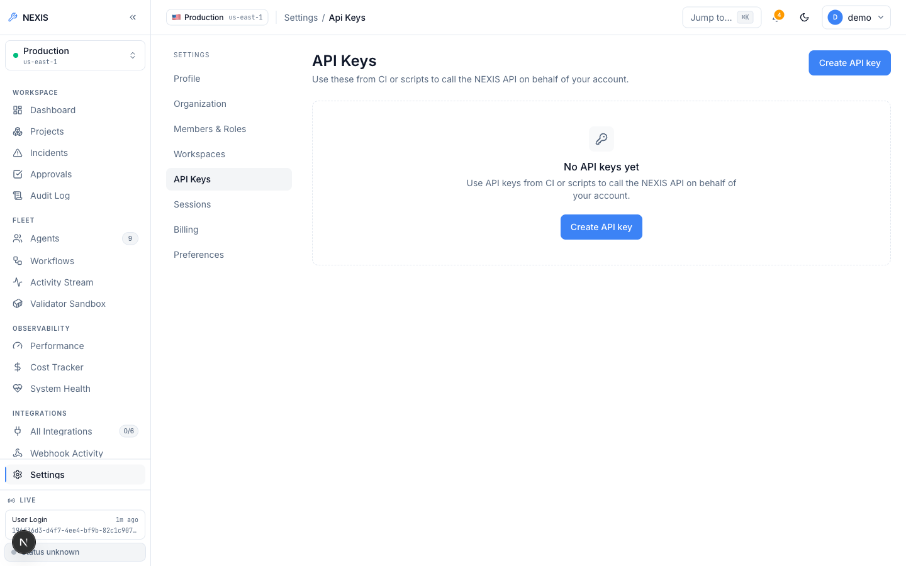

**Figure 5.12: API Keys Settings.** ( scoped bearer key creation, listing, and revocation ).

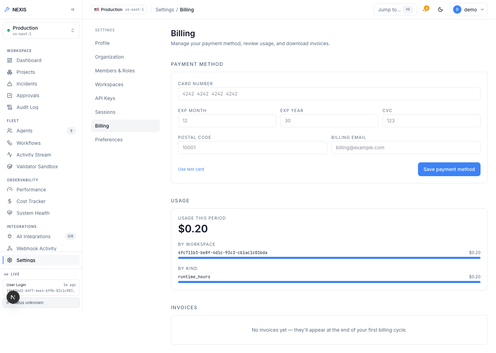

**Figure 5.13: Billing Settings.** ( Stripe usage and payment-method management ).

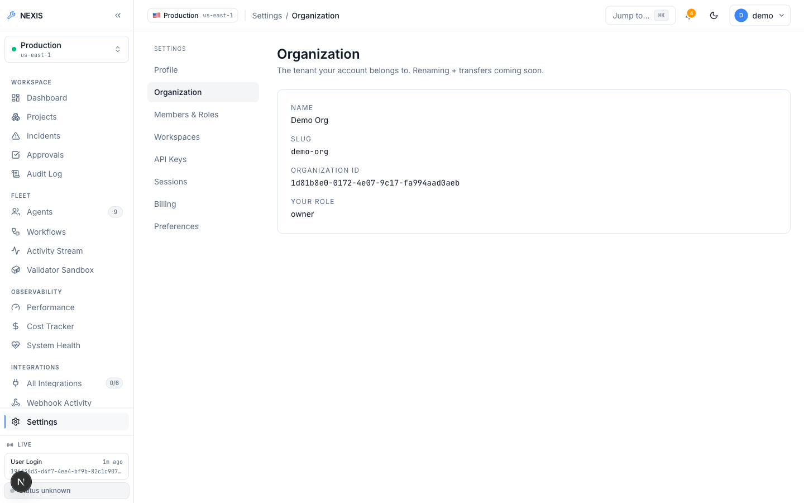

**Figure 5.14: Organization Settings.** ( organisation profile management ).

### 5.2.4 Self-Healing Loop — Live Evidence

The evidence in this subsection carries the most weight in the report, since it comes from two real, complete, end-to-end executions of the nine-agent RecoveryPipeline against a live local LLM (Ollama, `qwen2.5-coder:14b` and `gpt-oss:20b`). One run timed out at the human approval gate and was safely auto-rejected; the other was approved within the window and succeeded in full. It may be noted that both outcomes are shown exactly as they occurred.

Everything starts from the Live Demo console (Figure 5.15), which presents 27 curated fault-scenario cards drawn from a broader fixture taxonomy spanning application, database, deploy, observability, and security categories. To put it precisely, of these 27 scenarios, exactly one is fully wired end-to-end at present; the remaining cards are User Interface (UI)-complete but backend-pending, labelled "Coming soon" in the interface itself. The runs documented in the rest of this subsection were triggered through that one wired path.


**Figure 5.15: Live Demo Console.** ( 27-scenario fault-injection picker; one scenario fully wired, the rest backend-pending ).

Figure 5.16 catches the first run genuinely mid-flight: the Architect, Backend, and QA steps have already completed, each showing a real, non-zero token count and cost figure built up from actual LLM calls, while the DevOps and Data Engineer steps run in parallel behind them. These visible token and cost numbers are evidence in their own right, since a stubbed or templated pipeline would report zero tokens, whereas every completed step here carries the token consumption of the model call that actually produced its output.


**Figure 5.16: Incident Detail, Mid-Flight.** ( live pipeline with completed Architect/Backend/QA steps showing real token counts; DevOps and Data Engineer running in parallel ).

Figure 5.17 shows the same run a little later. Every Layer-1 and Layer-2 step has now completed green: the patch has been generated, property-tested, and validated in the sandbox, and the run sits at severity "Medium" with approval status "Pending", waiting on a human decision inside the 120-second window.


**Figure 5.17: Incident Detail, Pipeline Complete.** ( all Layer-1 and Layer-2 steps green; severity Medium, approval Pending ).

That pending state carries through to the Approvals queue (Figure 5.18), which shows a real pending-approval row with the three human decision actions: Reject, Modify, and Approve.


**Figure 5.18: Approvals Queue.** ( real pending approval row with Reject / Modify / Approve actions ).

Clicking Modify opens the dialog shown in Figure 5.19, and this is where the Reinforcement Learning from Human Feedback (RLHF) mechanism described in Chapter 4 becomes concrete: the engineer edits the LLM-generated unified diff directly inside the embedded editor before approving it. That edited diff, along with every other terminal approval decision, is persisted as a row in the `feedback_examples` table, and those rows feed a JSON Lines (JSONL) export endpoint intended for future fine-tuning. Actually submitting a paid fine-tuning job against the exported data remains a deliberate manual step rather than an automated one.


**Figure 5.19: Modify-and-Approve Dialog.** ( RLHF diff editing; the engineer's edit becomes a `feedback_examples` training row ).

An honest negative result appears in Figure 5.20, included here deliberately rather than omitted. In this first run, the 120-second approval window elapsed before any decision was recorded, so the workflow terminated the run as `timeout_rejected`. This is the timeout safety mechanism functioning precisely as it was designed to: when no human decision arrives in time, the system's default is to refuse deployment of unreviewed code rather than to proceed anyway. As such, a pipeline that silently auto-deployed on timeout would itself be a defect; here, that behaviour is the intended safe failure mode.


**Figure 5.20: Timeout-Rejected Run.** ( the 120-second approval window elapsed; the workflow safely auto-rejected as `timeout_rejected` rather than deploying unreviewed code ).

The key positive result of the report sits in Figure 5.21: a second live run, approved by a human inside the window. The incident shows severity "Medium", decision "Approved", and outcome "Succeeded". Its full nine-step timeline, running from detection through plan, patch generation, test generation, validation, approval, and deployment, completed end-to-end in 1 minute 40 seconds, with real per-agent token and cost figures recorded throughout.


**Figure 5.21: Fully Approved Run.** ( Medium severity, Approved, Succeeded; complete nine-step timeline in 1 minute 40 seconds with real per-agent token and cost figures ).

One question remains: whether the patch itself is genuinely LLM-generated, and Figure 5.22 settles it. It shows the expanded raw JSON payload of the Backend agent's step, including the actual unified diff produced by `qwen2.5-coder:14b`, with `provider="ollama"` recorded in the payload itself. The patch is model output parsed from a unified diff, not a template retrieved from a fixture.


**Figure 5.22: Backend Payload, Expanded.** ( raw JSON evidence of the `qwen2.5-coder:14b`-generated unified diff, provider="ollama" ).

### 5.2.5 Docker Preview-Deploy Engine (Ops Tab)

Each project detail page is organised into tabs. Overview (Figure 5.23) summarises the project, while Integrations (Figure 5.24) manages its provider connections, most importantly the GitHub repository binding. Recovery Policy (Figure 5.25) is where per-project self-healing behaviour gets configured, such as rollback on Service Level Objective (SLO) breach, and Activity (Figure 5.26) shows the project-scoped event history.

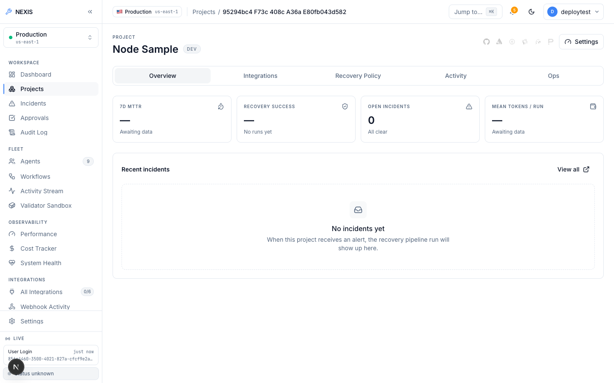

**Figure 5.23: Project Overview Tab.** ( project summary and health ).

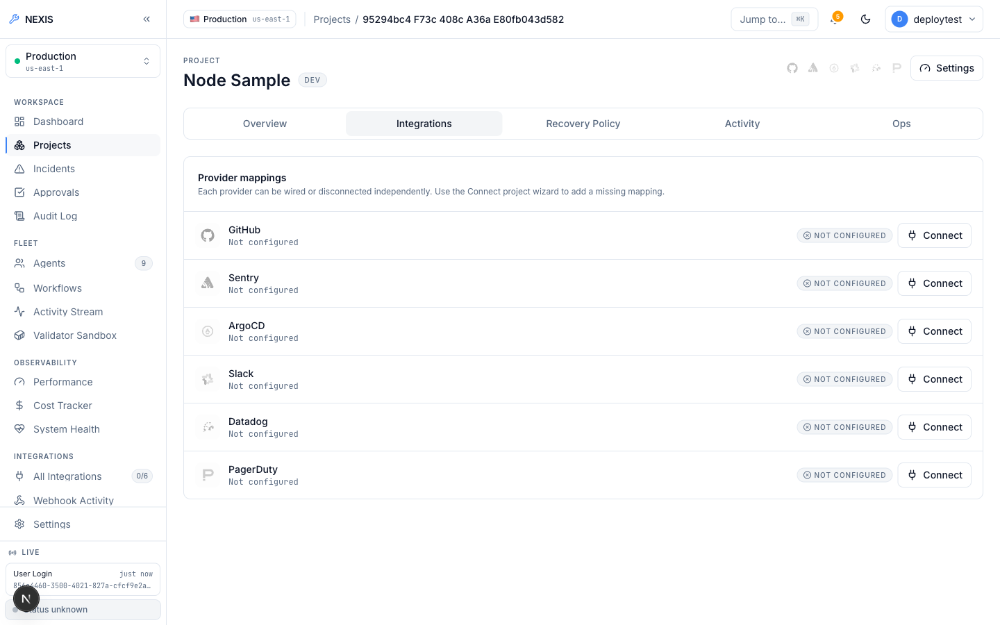

**Figure 5.24: Project Integrations Tab.** ( provider connections including the GitHub repository binding ).


**Figure 5.25: Project Recovery Policy Tab.** ( per-project self-healing configuration ).

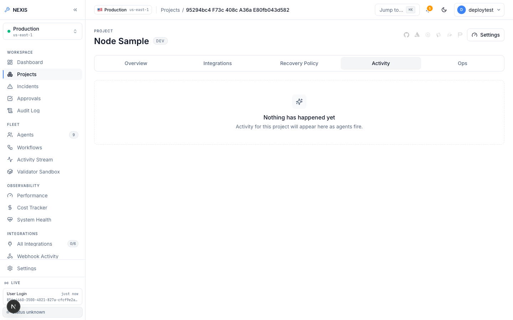

**Figure 5.26: Project Activity Tab.** ( project-scoped event history ).

The Ops tab is the frontend to the preview-deploy engine, and Figure 5.27 shows its empty state before any deployment has been made: the Deploy action, a live status area, and, once populated, the preview Uniform Resource Locator (URL) along with build/container logs and deployment history.


**Figure 5.27: Project Ops Tab, Empty State.** ( the Deploy panel before any deployment ).

Figure 5.28 shows what happened when Deploy was clicked on a project with no GitHub App connection in the evaluation environment: the real API returned the validation error "project has no github repository bound", and the UI surfaces this verbatim. This capture does *not* show a successful deploy; what it shows is the real validation chain rejecting a deploy request that cannot be fulfilled, which is the correct behaviour here. The limitation is environmental, since no GitHub App credentials exist in the evaluation environment (as stated in Chapter 7's limitations), rather than being a defect in the engine itself.


**Figure 5.28: Project Ops Tab, Deploy Attempt.** ( a real validation error — "project has no github repository bound" — returned by the live API ).

The engine itself, however, was proven live quite apart from that credential limitation. Furthermore, Listing 5.1 reproduces, verbatim, the verified end-to-end run recorded during this project. A real public repository (`heroku/node-js-getting-started`, which contains no Dockerfile) was cloned; its stack was detected as Node.js from marker files; a working Dockerfile was generated, the image built, and the container run under resource limits. A Hypertext Transfer Protocol (HTTP) request to the returned preview URL then served the application's real rendered HyperText Markup Language (HTML) page, after which the container was stopped and removed cleanly.

```text
POST /v1/deploy  (repo: heroku/node-js-getting-started, no Dockerfile present)
-> 200 OK
  "status": "running", "dockerfile_source": "generated", "detected_stack": "node",
  "url": "http://localhost:54671", "image_tag": "nexis-preview-test-project:22d06076c357"
  build_log: "...npm ci... EXPOSE 3000... CMD [\"npm\",\"start\"]..."
  container_log: "Listening on 3000\nRendering 'pages/index' for route '/'"

GET http://localhost:54671/  -> real rendered HTML of the Node app (verified)

POST /v1/deploy/test-e2e-001/stop -> {"status":"stopped"}; container removed.
```

**Listing 5.1: Verified live deploy-engine run.**

Should a build or health check fail, the control plane inserts a real incident carrying `source: "deploy_engine"` into the same Sentinel-to-RecoveryPipeline path used by every other incident source. A broken build or an unrecognised stack thus becomes a self-healing target in exactly the same way as any production fault.

### 5.2.6 Projects, Agents, and Observability

Projects appear as cards on the Projects page (Figure 5.29), and new ones are created through the wizard shown in Figure 5.30, which derives sensible defaults from the project name. Each agent also has its own detail page (Figure 5.31 shows the Backend agent's), and the Recovery Pipeline page (Figure 5.32) presents the pipeline structure itself.

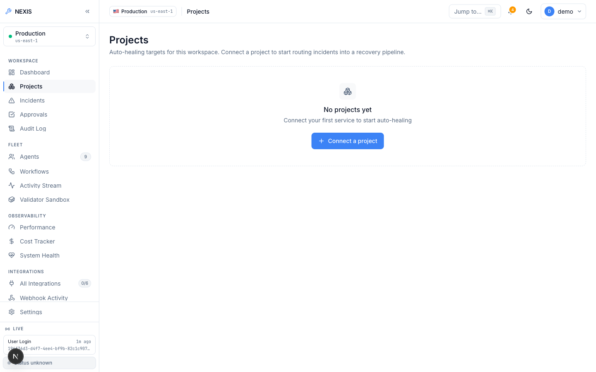

**Figure 5.29: Projects Screen.** ( project cards with health indicators ).

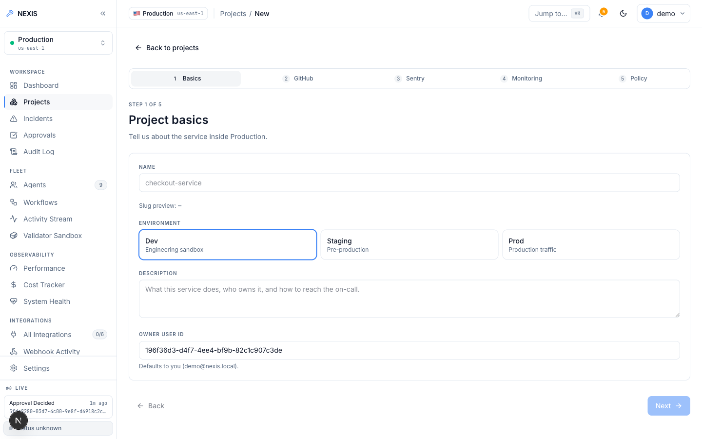

**Figure 5.30: New-Project Wizard.** ( guided project creation ).


**Figure 5.31: Agent Detail, Backend Agent.** ( per-agent configuration and run history ).


**Figure 5.32: Recovery Pipeline Screen.** ( the nine-agent pipeline structure ).

Observability is spread across four pages. Performance (Figure 5.33) charts pipeline latency and throughput, and the Cost Tracker (Figure 5.34) rolls up the per-organisation token ledger against a configurable daily budget. System Health (Figure 5.35) fans out parallel dependency probes against PostgreSQL, Redis, Neo4j, MinIO, and Temporal under a bounded timeout and reports each result, while the Evaluation (Eval) Harness (Figure 5.36) runs side-by-side OpenAI-versus-Ollama provider comparisons across fixture incidents, with persisted transcripts, cost accounting, and an administrator-only CSV export. The Knowledge Base page (Figure 5.37), finally, reports the status of the pgvector-backed retrieval store.

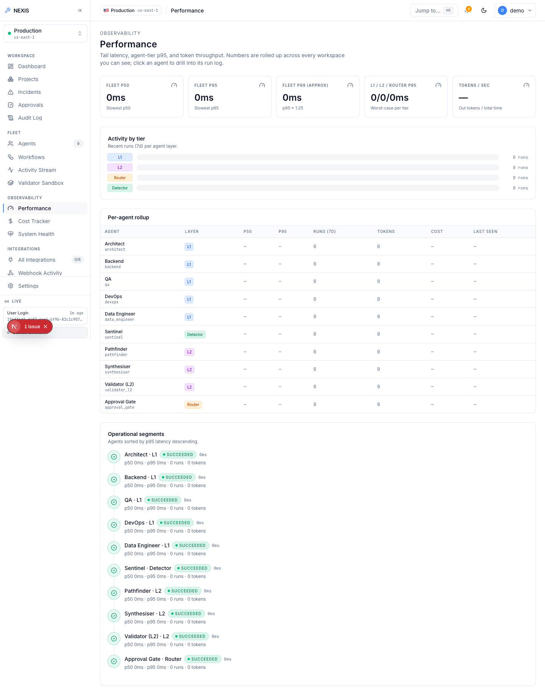

**Figure 5.33: Performance Screen.** ( pipeline latency and throughput charts ).

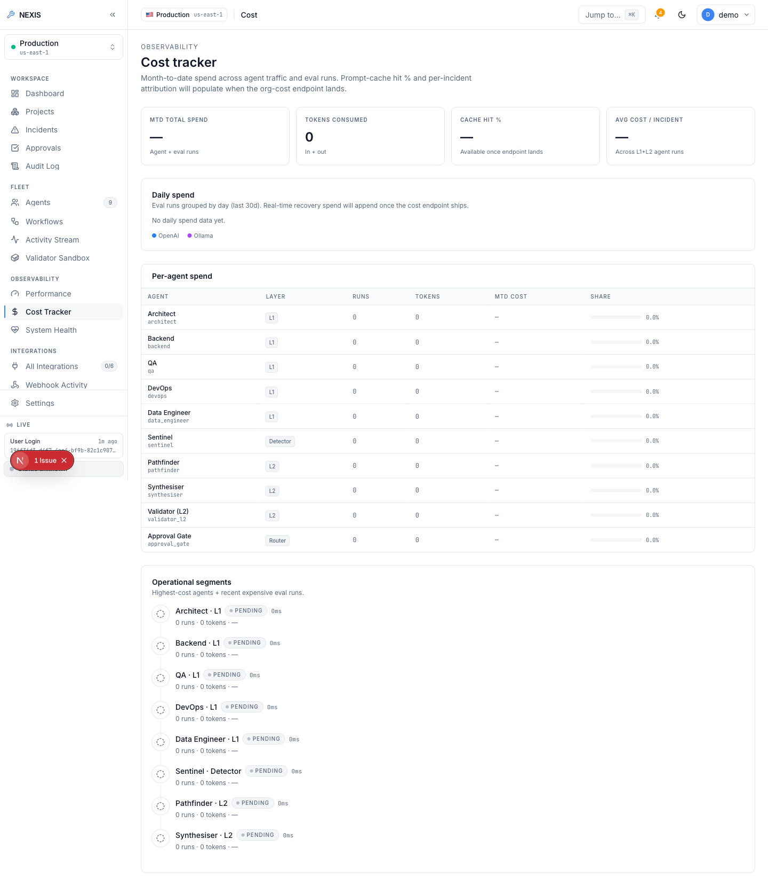

**Figure 5.34: Cost Tracker.** ( per-organisation token ledger with daily budget ).


**Figure 5.35: System Health.** ( parallel dependency probes: PostgreSQL, Redis, Neo4j, MinIO, Temporal ).


**Figure 5.36: Eval Harness.** ( side-by-side OpenAI-versus-Ollama comparison over fixture incidents ).

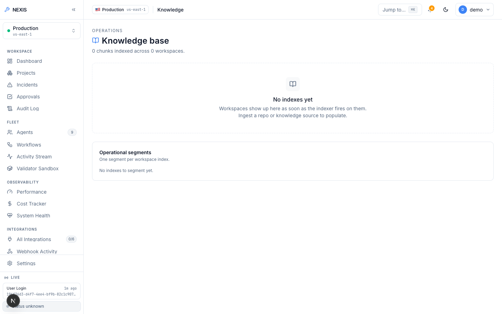

**Figure 5.37: Knowledge Base.** ( pgvector-backed retrieval status ).

### 5.2.7 Integrations

The platform's external providers are managed from the Integrations page (Figure 5.38): the GitHub App (covering installation, repository listing, and webhook-driven incident creation on merged pull requests), Sentry [14], Datadog [16], and PagerDuty [15] as webhook-driven incident sources, Slack [17] with OAuth install and interactive one-click approve/reject directly from a Slack message, and, beyond these, Argo CD and Stripe billing. Webhook Activity (Figure 5.39) lists inbound webhook deliveries for debugging purposes, while Connection Health (Figure 5.40) probes each configured integration and reports its status.


**Figure 5.38: Integrations Screen.** ( provider catalogue: GitHub App, Sentry, Datadog, PagerDuty, Slack, Argo CD, Stripe ).

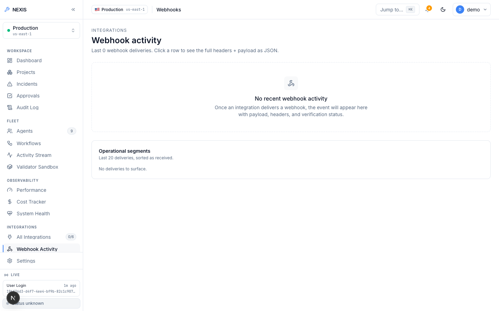

**Figure 5.39: Webhook Activity.** ( inbound webhook delivery log ).

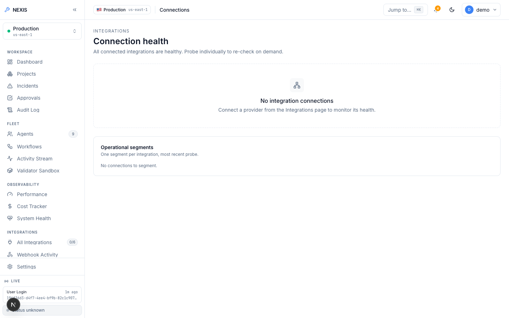

**Figure 5.40: Connection Health.** ( per-integration health probes ).

## 5.3 Database Schema

Nexis keeps its state in PostgreSQL 17, and the schema has grown incrementally across 33 sequential migrations, each one tracked in version control alongside the code that depends on it. Multi-tenancy is enforced inside the database itself rather than in application code. Moreover, nearly every table carries an organisation identifier, and PostgreSQL Row-Level Security policies [7] restrict every query to the calling organisation's own rows. A request-scoped transaction binds `app.current_org_id` for each API request, which means that even a query that omits an explicit `WHERE` clause on the organisation still cannot read or write another tenant's data.

Table 5.1 summarises the key tables. Organisation-scoping has two deliberate exceptions: `users` is a global identity table, since a person may belong to several organisations, with tenancy applied through `org_members`; and `sessions` is scoped to the owning user rather than to an organisation, because a login session belongs to a person and not to a tenant.

**Table 5.1: Key tenant-scoped tables in the Nexis PostgreSQL schema.**

| Table | Purpose | RLS scope |
|---|---|---|
| `users` | Global account identity: credentials, Multi-Factor Authentication (MFA) enrolment, profile | Global (identity) |
| `org_members` | User–organisation membership and role (`owner` / `admin` / `member`) | Organisation-scoped |
| `projects` | Registered projects, GitHub repository binding, recovery policy | Organisation-scoped |
| `incidents_raw` | Every ingested fault event, from webhooks, fixtures, and the deploy engine | Organisation-scoped |
| `workflow_runs` | One row per Temporal RecoveryPipeline execution, with per-step activity events | Organisation-scoped |
| `approval_decisions` | Terminal approval-gate outcomes: approve, reject, modify, timeout | Organisation-scoped |
| `deployments` | Preview-deploy engine builds/containers and GitOps deployments | Organisation-scoped |
| `lineage_events` | OpenLineage-compatible RunEvents [8] for migration propose/apply | Organisation-scoped |
| `audit_log` | Append-only, hash-chained record of privileged actions | Organisation-scoped |
| `feedback_examples` | RLHF training rows persisted from every terminal approval decision | Organisation-scoped |
| `role_recommendations` | Heuristic role-change recommendations with rationale and cool-down state | Organisation-scoped |
| `digest_reports` | Daily administrator digest aggregates (incidents, repairs, approvals, MTTR) | Organisation-scoped |
| `sessions` | Active login sessions: device, IP, user agent, last-seen | User-scoped |
| `api_keys` | Scoped bearer keys (`nx_live_...`) for programmatic access | Organisation-scoped |

Beyond relational state, three specialised stores complete the data layer. Neo4j holds the code dependency graph traversed by the Pathfinder agent, MinIO holds encrypted patch blobs referenced from `workflow_runs`, and pgvector columns inside PostgreSQL back the knowledge-base retrieval feature. Temporal, in addition, maintains its own durable persistence for workflow event histories; this complements the per-step records in `workflow_runs`, and in a recovery scenario, can reconstruct them.
