# Chapter 5: Implementation

This chapter documents the implemented system as it exists and runs today: the technology stack, a screen-by-screen walk through the platform, and the database schema beneath the multi-tenant control plane. All screenshots are unretouched captures of the running development environment; errors and pending states are reported as-is rather than substituted with more flattering captures.

## 5.1 Tools and Technology

Nexis is a polyglot pnpm + Turborepo monorepo, each subsystem in the language best suited to its role:

- **Backend** — Go 1.25 in four modules: `services/control-plane` (multi-tenant API), `services/validator` (sandboxed patch validation), `services/gitops` (GitHub-App deployment), `services/deploy-engine` (Docker preview deploys); a Python/FastAPI sidecar, `services/causal-inference` (port 8090), ranks candidate root-cause nodes for the Pathfinder agent; Temporal [2] durably orchestrates the nine-agent RecoveryPipeline — every step an ActivityEvent, crashed workers resume in place.
- **Frontend** — Next.js 16 / React 19 / TypeScript (`apps/web`); Tailwind CSS 4 and Radix UI; Monaco for unified-diff editing; Recharts; Server-Sent Events for live incident pages without polling.
- **Data** — PostgreSQL 17 (system of record, Row-Level Security (RLS) [7], 33 migrations); pgvector [19] (knowledge-base retrieval); Neo4j [3] (code dependency graph); Redis (rate limiting, caching); MinIO (S3-compatible encrypted patch blobs); Temporal's own durable event history.
- **AI / LLM** — OpenAI (GPT-4o family) is the production-configured provider; Ollama [20] (`gpt-oss:20b`, `qwen2.5-coder:14b`) is fully supported — all live-run evidence in this chapter used Ollama end-to-end, with no cloud Large Language Model (LLM) credentials. The Quality Assurance (QA) agent generates Hypothesis [9] property-based tests that the Validator executes in its sandbox. The causal-inference sidecar is a statistical/graph ranking algorithm, not a fitted DoWhy [4] model — that would need interventional production data that does not yet exist, a limitation stated openly.
- **DevOps** — Docker API [10] for both the Validator sandbox and preview deploys (Podman-compatible [11]; Podman substituted in the evaluation environment worked identically); Terraform to AWS ECS behind a load balancer; OpenTelemetry [5] to Prometheus, Loki, Tempo, and Grafana; Argo CD [6] for the DevOps agent's Sync/Rollback client.
- **Version control** — Git and GitHub; a GitHub App installation supplies short-lived tokens for cloning and the GitOps blob → tree → commit → ref → Pull Request deployment path.

## 5.2 Project View

The captures below follow the order a new organisation would encounter the platform.

### 5.2.1 Authentication and Onboarding

Access is a local JSON Web Token (JWT) session (HttpOnly cookie) with optional WorkOS [12] Single Sign-On. Sign-up (Figure 5.1) creates the account; forgot-password issues a 32-byte reset token, SHA-256-hashed with a 30-minute time-to-live, and returns the same 202 response whether or not the e-mail exists, leaking no account information.

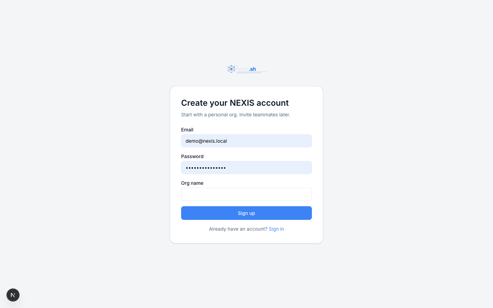{width=64%}

**Figure 5.1: Sign-Up Screen.** ( new account registration ).

### 5.2.2 Administrator / Owner Console

The console home (Figure 5.2) shows KPI tiles for Mean Time To Recovery (MTTR), recovery success rate, open incidents, and mean tokens per run, with an incidents-over-time chart, system status, projects health grid, and activity feed.

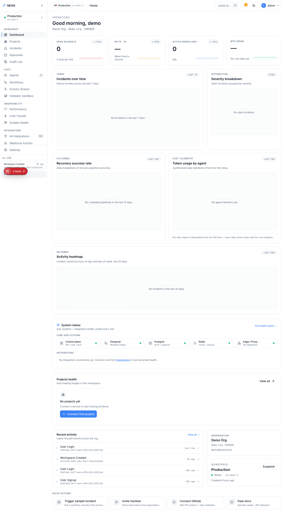{width=64%}

**Figure 5.2: Administrator Dashboard.** ( KPI tiles, incidents-over-time chart, and system status panel ).

The Agents page (Figure 5.3) lists the nine-agent fleet across both layers — the five Execution Team agents (Architect, Backend, QA, DevOps, Data Engineer) and the Self-Healing Loop agents (Sentinel, Pathfinder, Synthesiser, Validator); the Incidents page (Figure 5.4) lists every ingested incident.

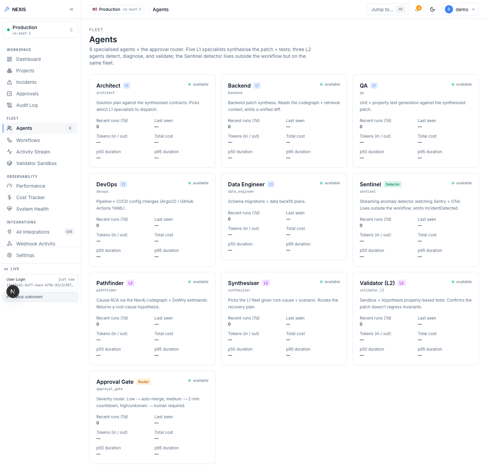{width=64%}

**Figure 5.3: Agents Screen.** ( the nine-agent fleet roster across both layers ).

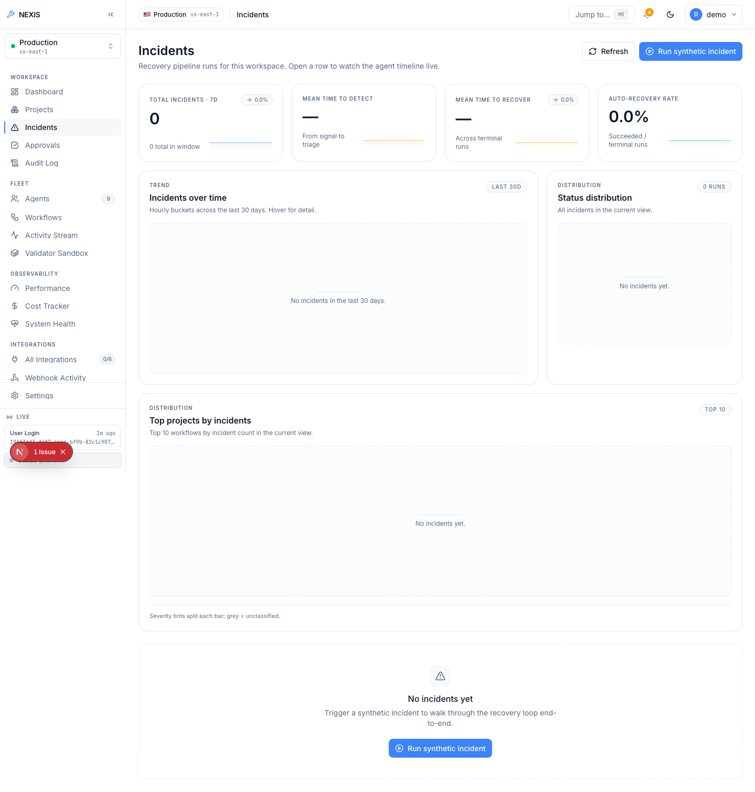{width=64%}

**Figure 5.4: Incidents Screen.** ( the organisation-wide incident list ).

Settings cover members with `owner` / `admin` / `member` roles and a real heuristic role-recommendation panel (evidence-backed rationales, 30-day cool-down on dismissal), remotely revocable sessions, scoped API keys (`nx_live_...`), and Stripe billing [13].

### 5.2.3 Self-Healing Loop — Live Evidence

This subsection is the evidentiary core of the report: two real, end-to-end executions of the nine-agent RecoveryPipeline against a live local LLM (Ollama, `qwen2.5-coder:14b` and `gpt-oss:20b`) — one safely auto-rejected at the approval gate, one approved and fully succeeded — shown exactly as they occurred. The Live Demo entry point offers 27 fault-scenario cards; exactly one is fully wired end-to-end today, the rest UI-complete but backend-pending, labelled "Coming soon". Both runs used the wired path; Figure 5.5 shows the pipeline structure.

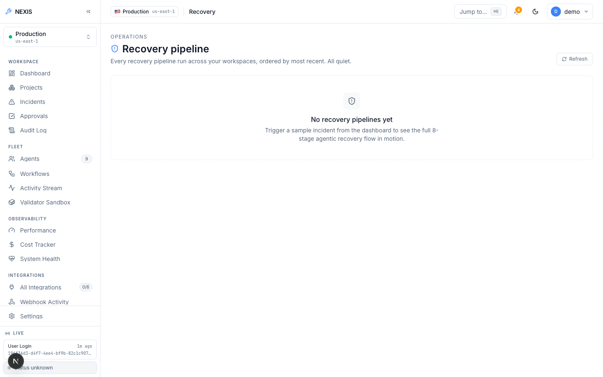{width=64%}

**Figure 5.5: Recovery Pipeline Screen.** ( the nine-agent pipeline structure ).

Figure 5.6 captures the first run genuinely mid-flight: Architect, Backend, and QA have completed with real, non-zero token counts and costs from actual LLM calls while DevOps and Data Engineer run in parallel. A stubbed pipeline would report zero tokens; these figures are themselves evidence.

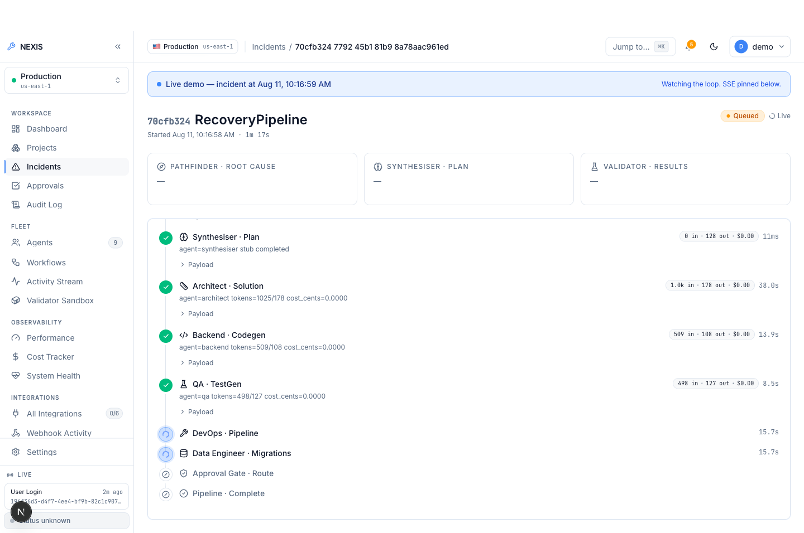{width=64%}

**Figure 5.6: Incident Detail, Mid-Flight.** ( completed Architect/Backend/QA steps with real token counts; DevOps and Data Engineer running in parallel ).

Every step then completed green, leaving severity "Medium" and approval "Pending" inside a 120-second window. The window elapsed with no decision and the workflow terminated as `timeout_rejected` — an honest negative result, reported deliberately: absent a human decision, the system refuses to deploy unreviewed code rather than proceeding.

The second run, approved within the window, is the key positive result (Figure 5.7): "Medium" severity, "Approved", "Succeeded", the full nine-step timeline completing in 1 minute 40 seconds with real per-agent token and cost figures.

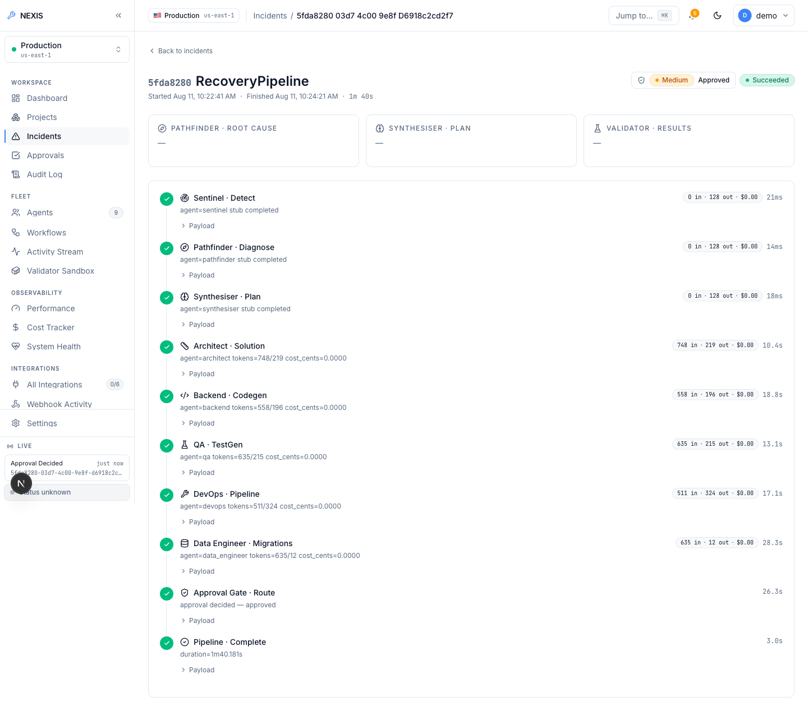{width=64%}

**Figure 5.7: Fully Approved Run.** ( Medium severity, Approved, Succeeded; complete nine-step timeline in 1 minute 40 seconds ).

Pending runs surface in the Approvals queue (Figure 5.8) with three human actions — Reject, Modify, Approve — decided in the dialog of Figure 5.9. Modify is the Reinforcement Learning from Human Feedback (RLHF) mechanism made concrete: the engineer edits the LLM-generated unified diff before approving, and the edited diff — with every terminal decision — is persisted to `feedback_examples`, feeding a JSONL export for future fine-tuning; submitting a paid fine-tuning job is a deliberate manual step, not automated.

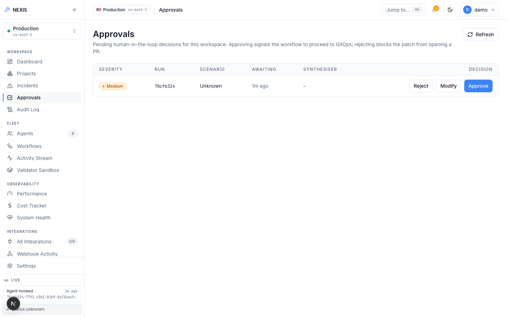{width=64%}

**Figure 5.8: Approvals Queue.** ( real pending approval row with Reject / Modify / Approve actions ).

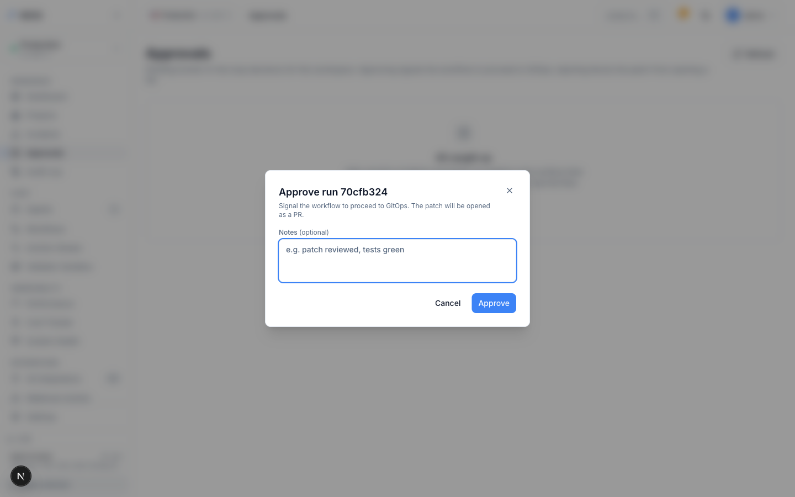{width=64%}

**Figure 5.9: Approval Decision Dialog.** ( the Reject / Modify / Approve decision surface for a pending patch ).

The patch is genuinely model-generated: the Backend step's raw JSON records the unified diff produced by `qwen2.5-coder:14b` with `provider="ollama"` — parsed model output, not a fixture template. Figure 5.10 shows the Backend agent's own detail page.

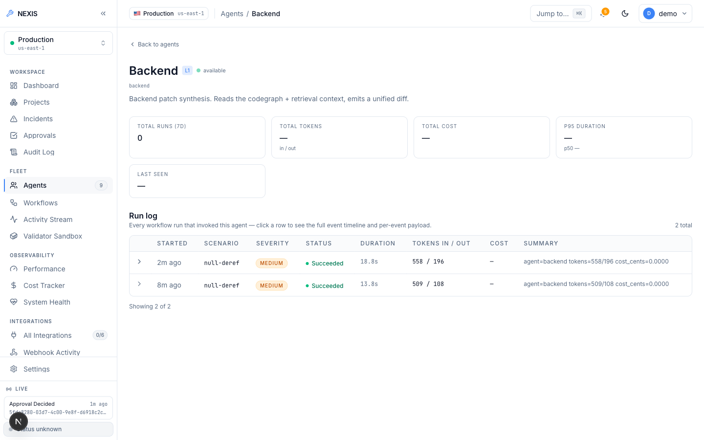{width=64%}

**Figure 5.10: Agent Detail, Backend Agent.** ( per-agent configuration and run history ).

### 5.2.4 Docker Preview-Deploy Engine (Ops Tab)

The project Ops tab fronts the preview-deploy engine (Deploy action, live status, preview URL, logs, history). In Figure 5.11, Deploy on a project with no GitHub App connection returned the real validation error "project has no github repository bound", surfaced verbatim. This is *not* a successful deploy — it is the validation chain correctly rejecting an unfulfillable request; the limitation is environmental (no GitHub App credentials in the evaluation environment), not an engine defect.

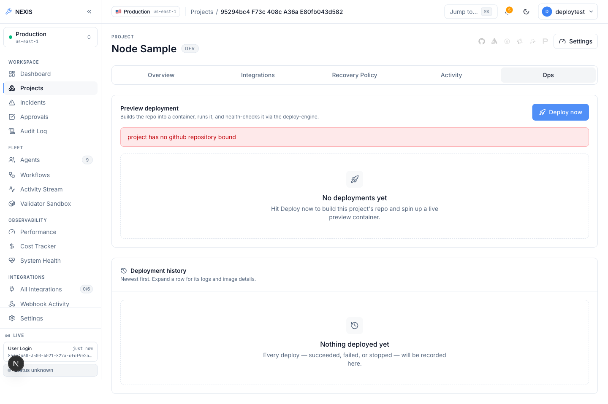{width=64%}

**Figure 5.11: Project Ops Tab, Deploy Attempt.** ( a real validation error — "project has no github repository bound" — returned by the live API ).

The engine was proven live independently of that limitation (Listing 5.1): `heroku/node-js-getting-started` (no Dockerfile) was cloned, detected as Node.js, given a generated Dockerfile, built, and run under resource limits; the preview URL served the app's real rendered HTML before a clean stop and removal.

```text
POST /v1/deploy  (repo: heroku/node-js-getting-started, no Dockerfile present)
-> 200 OK
  "status": "running", "dockerfile_source": "generated", "detected_stack": "node",
  "url": "http://localhost:54671", "image_tag": "nexis-preview-test-project:22d06076c357"

GET http://localhost:54671/  -> real rendered HTML of the Node app (verified)

POST /v1/deploy/test-e2e-001/stop -> {"status":"stopped"}; container removed.
```

**Listing 5.1: Verified live deploy-engine run.**

A failed build or health check inserts a real incident with `source: "deploy_engine"` into the same Sentinel-to-RecoveryPipeline path as every other incident source.

### 5.2.5 Integrations and Observability

The Integrations page (Figure 5.12) manages external providers: the GitHub App (installation, repository listing, webhook-driven incidents on merged pull requests), Sentry [14], Datadog [16], and PagerDuty [15] as webhook incident sources, Slack [17] with OAuth install and one-click approve/reject from a Slack message, Argo CD, and Stripe; companion pages log webhook deliveries and probe integration health.

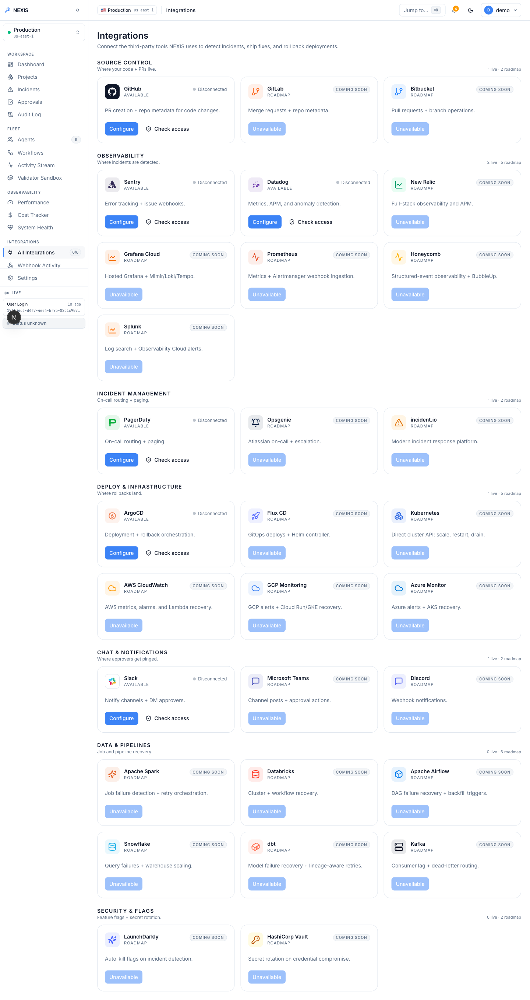{width=64%}

**Figure 5.12: Integrations Screen.** ( provider catalogue: GitHub App, Sentry, Datadog, PagerDuty, Slack, Argo CD, Stripe ).

Observability adds performance charts, a per-organisation token cost tracker with daily budget, parallel system-health probes (PostgreSQL, Redis, Neo4j, MinIO, Temporal), and a pgvector-backed knowledge base. The Eval Harness (Figure 5.13) runs side-by-side OpenAI-versus-Ollama comparisons across fixture incidents, with persisted transcripts, cost accounting, and administrator-only CSV export.

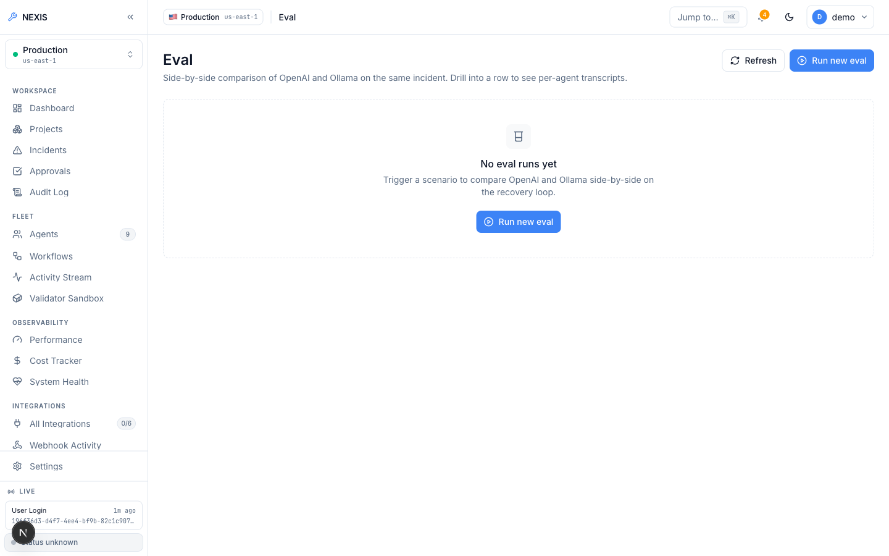{width=64%}

**Figure 5.13: Eval Harness.** ( side-by-side OpenAI-versus-Ollama comparison over fixture incidents ).

The Audit Log (Figure 5.14) is append-only and hash-chained — each entry incorporates its predecessor's hash, so tampering breaks the chain and is detectable by the verify endpoint — with CSV export for offline review.

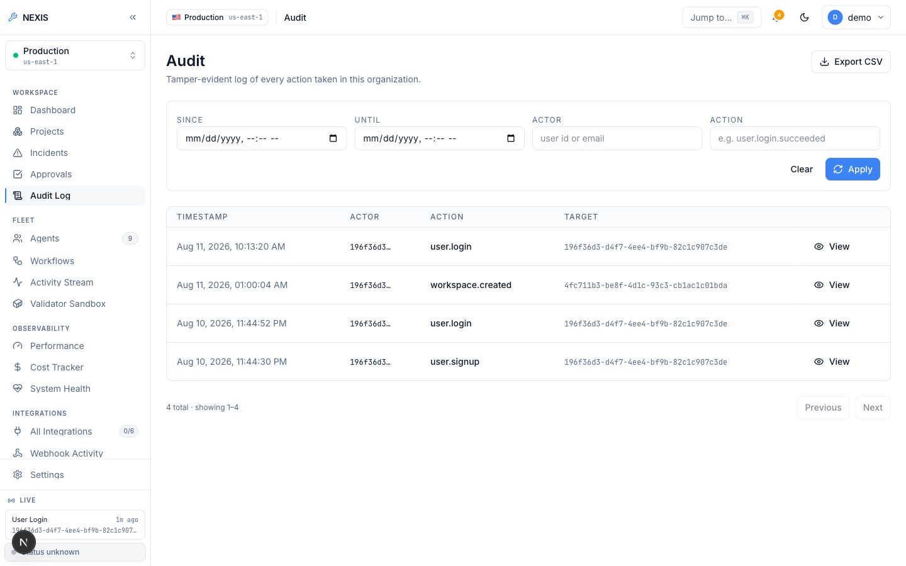{width=64%}

**Figure 5.14: Audit Log.** ( append-only, hash-chained entries with CSV export ).

## 5.3 Database Schema

State lives in PostgreSQL 17 across 33 sequential migrations. Multi-tenancy is enforced in the database itself: nearly every table carries an organisation identifier, RLS policies [7] restrict queries to the calling organisation's rows, and a request-scoped transaction binds `app.current_org_id`, so even a query omitting an organisation `WHERE` clause cannot touch another tenant's data. Two deliberate exceptions: `users` is global identity (tenancy applied through `org_members`), and `sessions` is user-scoped — a login session belongs to a person, not a tenant. Table 5.1 lists the most important tenant-scoped tables.

**Table 5.1: Key tenant-scoped tables in the Nexis PostgreSQL schema.**

| Table | Purpose | RLS scope |
|---|---|---|
| `incidents_raw` | Every ingested fault event, from webhooks, fixtures, and the deploy engine | Organisation-scoped |
| `workflow_runs` | One row per Temporal RecoveryPipeline execution, with per-step activity events | Organisation-scoped |
| `approval_decisions` | Terminal approval-gate outcomes: approve, reject, modify, timeout | Organisation-scoped |
| `feedback_examples` | RLHF training rows persisted from every terminal approval decision | Organisation-scoped |
| `audit_log` | Append-only, hash-chained record of privileged actions | Organisation-scoped |

Neo4j holds the dependency graph the Pathfinder traverses, MinIO the encrypted patch blobs referenced from `workflow_runs`, and pgvector columns back knowledge-base retrieval; Temporal's durable event history can reconstruct the per-step records in `workflow_runs` in a recovery scenario.
