# Chapter 4: System Design and Architecture

The design of Nexis is presented across four complementary levels in this chapter: the structural view (Sections 4.1–4.5), the functional view through use case diagrams (4.6), the data view through Data Flow Diagrams (4.7), and a UML sequence diagram tracing one complete recovery run (4.8). Since the self-healing loop is the central contribution of the project, it has been given the most space of the four.

## 4.1 System Context

Figure 4.1 places Nexis at the centre of its environment. Three human roles sit around it (Owner/Administrator, Engineer/Member, Viewer), the nine-agent fleet acts as a fourth, autonomous actor, and a wider ring of external systems completes the picture: GitHub, Slack [17], the LLM provider (OpenAI or Ollama), Argo CD, Stripe [13], the alert sources Sentry [14], Datadog [16], and PagerDuty [15], WorkOS SSO [12], and SES/SMTP mail.

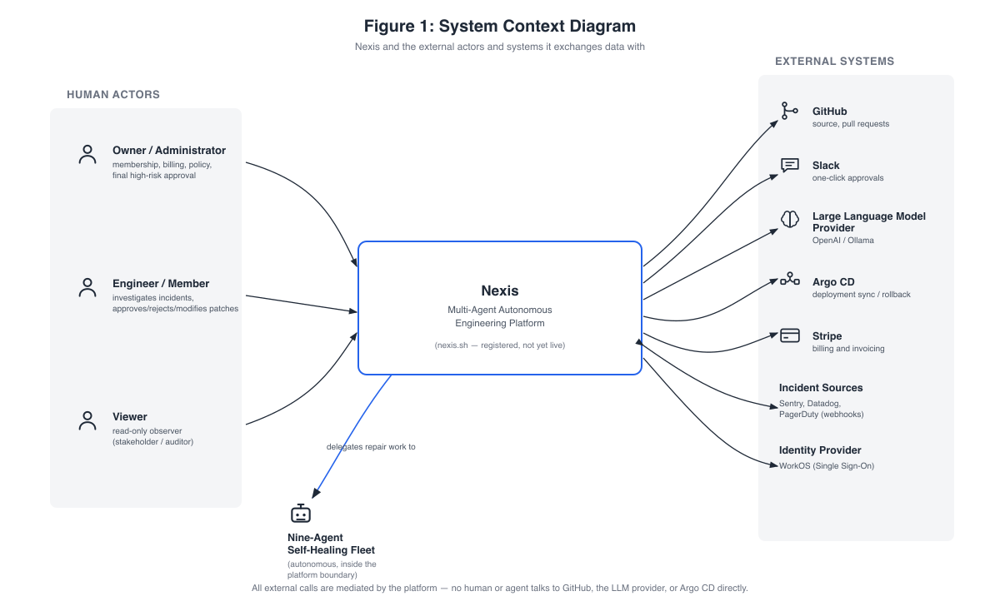{width=74%}

**Figure 4.1: System Context Diagram.** ( Nexis and the external actors and systems it exchanges data with ).

Every entry point, whether the web console, webhooks, Slack callbacks, or a plain HTTP client, converges on the control-plane; no human or agent talks to a data store or an external integration directly. It should be disclosed plainly that the `nexis.sh` domain is registered, but the platform is not yet publicly live (Section 4.5).

## 4.2 Component Architecture

Figure 4.2 opens up the platform boundary. The Next.js 16 web console sits to one side; moreover, the centre is anchored by a single Go control-plane (`:8080`) that hosts the chi-routed API layer (authentication, RBAC, RLS binding, rate limiting), the always-on Sentinel detector (EWMA +3σ spike rule), and the durable Temporal RecoveryPipeline workflow [2], which orchestrates the nine-agent loop.

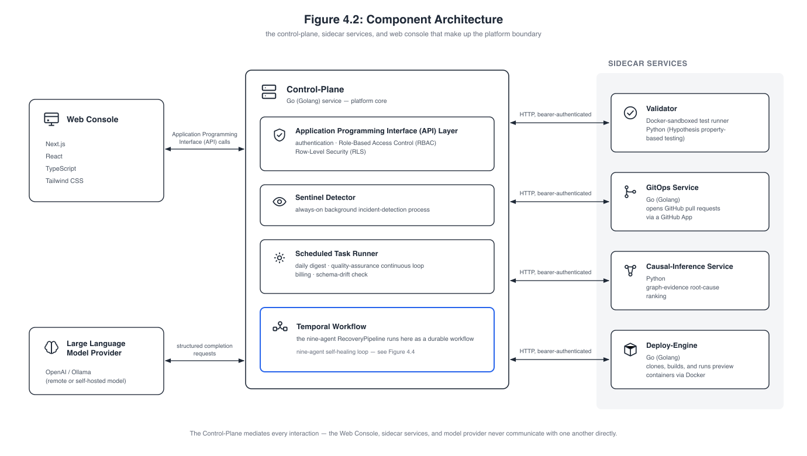{width=74%}

**Figure 4.2: Component Architecture.** ( the control-plane, sidecar services, and web console that make up the platform boundary ).

The control-plane also carries the scheduled task runner (daily digest, the continuous-QA loop, billing tickers, schema-drift detection), and the Temporal RecoveryPipeline it hosts orchestrates the nine-agent loop as one durable workflow: detect → diagnose → plan → design → code → test → package/migrate → approve (severity-routed) → deploy → verify → roll back if needed. Four bearer-authenticated sidecars sit around it, each independently deployable and reachable only from the control-plane:

- **Validator** (`:8081`) — the Docker-sandboxed test runner [10] that shadow-executes every candidate patch under `--network=none`, `--read-only`, and `--cap-drop=ALL`, running the QA-generated Hypothesis property tests [9];
- **GitOps service** (`:8082`) — GitHub App pull-request automation along the blob → tree → commit → ref → PR path;
- **Causal-inference service** (`:8090`) — the Python/FastAPI graph-evidence ranker scoring Pathfinder's candidates by evidence-chain specificity, structural proximity, and textual overlap, an honest statistical proxy rather than a fitted structural causal model [4];
- **Deploy-engine** (`:8091`) — clone, stack detection, Dockerfile generation, build, and health-checked container run for preview deployments.

An Argo CD client module supplies the Sync and Rollback integration [6] used by the post-deploy SLO probe. The LLM spine, for its part, pairs OpenAI (`gpt-4o` family) with Ollama [20] (`gpt-oss:20b`, `qwen2.5-coder:14b`) as a fully supported alternative, backed by pgvector retrieval [19] that feeds code-context passages to the Architect, Backend, and QA agents, and by a structured-output stage that validates every completion against a per-agent JSON Schema and retries on mismatch. The mediation rule from Section 4.1 holds throughout: console, sidecars, and model provider never talk to one another directly.

## 4.3 Data and Storage Architecture

The four storage systems, along with Temporal's workflow persistence layer, are laid out in Figure 4.3.

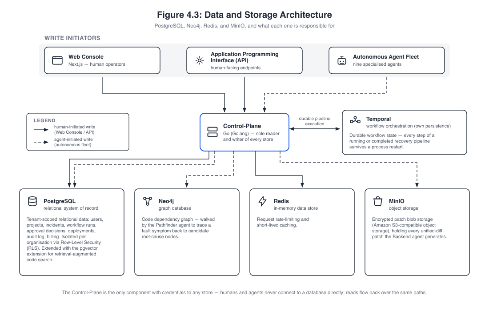{width=74%}

**Figure 4.3: Data and Storage Architecture.** ( PostgreSQL, Neo4j, Redis, and MinIO, and what each one is responsible for ).

PostgreSQL 17 with pgvector is the relational system of record, made multi-tenant via Row-Level Security [7] across 33 migrations; its key tenant-scoped tables (`users`, `org_members`, `projects`, `incidents_raw`, `workflow_runs`, `approval_decisions`, `deployments`, `lineage_events`, `audit_log`, `feedback_examples`, `role_recommendations`, `digest_reports`) reappear as the data stores of the Data Flow Diagrams in Section 4.7. Neo4j [3] holds each connected repository's code dependency graph, which Pathfinder walks from symptom to candidate root cause; Temporal maintains its own persistence, so every step of a running or completed pipeline survives a process restart; Redis serves rate limiting and short-lived caching; and MinIO is the encrypted patch store, S3-compatible object storage holding every unified diff the Backend agent generates.

The diagram also separates the two classes of write initiator, human writes arriving through the console and API, and agent writes from the autonomous fleet, which is what makes the isolation claim in its footer meaningful: only the control-plane holds credentials to any store, neither humans nor agents ever connect to a database directly, and reads flow back over those same mediated paths.

## 4.4 Self-Healing Loop Pipeline

Figure 4.4 presents the central contribution of the project as a single flow, the nine agents running in order: Sentinel (detect), Pathfinder (localise via the Neo4j graph), Synthesiser (classify, select agents), Architect (plan and file-level contract), Backend (minimal patch), Quality Assurance (property-based tests), DevOps running in parallel with Data Engineer (manifests and migrations), and finally Validator (sandboxed shadow-execution).

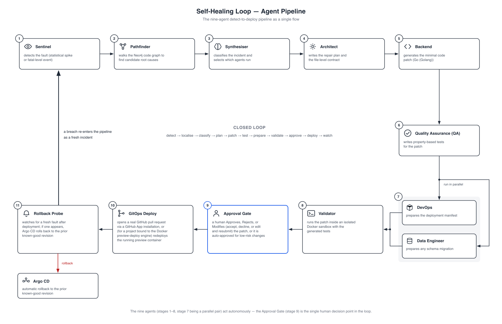{width=74%}

**Figure 4.4: Self-Healing Loop — Agent Pipeline.** ( the nine-agent detect-to-deploy pipeline as a single flow ).

A person enters the loop only at this point: the Approval Gate (approve, reject, or modify; auto-approved for low-risk changes) forms the single human decision point in the whole pipeline. GitOps Deploy consequently opens a real pull request through a GitHub App installation or, for a project bound to the preview-deploy engine, redeploys the running preview container, while the Rollback Probe watches for a fresh fault afterwards: should one appear, Argo CD rolls back to the prior known-good revision and the breach re-enters the pipeline as a fresh incident.

The closing arc of the figure captures the property that gives the project its title — detect → localise → classify → plan → patch → test → prepare → validate → approve → deploy → watch, with the watch stage feeding back into detection. Sections 4.7.3 and 4.8 decompose that same flow into its data stores and its message-by-message timing.

## 4.5 Deployment and Infrastructure

Figure 4.5 lays out how the platform is built, delivered, and observed: GitHub Actions handles CI, Docker (Podman-compatible) serves as the universal runtime, Argo CD carries out GitOps delivery, and Terraform declares the AWS infrastructure as code.

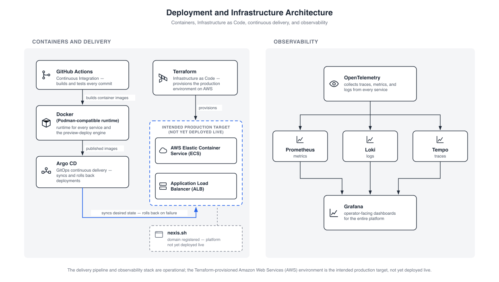{width=74%}

**Figure 4.5: Deployment and Infrastructure Architecture.** ( containers, Infrastructure as Code, continuous delivery, and observability ).

On the delivery side, GitHub Actions builds and tests every commit and produces the container images, Argo CD syncs desired state and rolls back on failure, and Terraform declares the production environment as code. This diagram, too, is deliberately honest about status: the AWS ECS cluster behind an Application Load Balancer is the *intended* production target declared in Terraform, not yet deployed live, and the registered `nexis.sh` domain does not yet serve the platform. Observability across all layers follows the OpenTelemetry pipeline [5], with traces, metrics, and logs collected from every service into Prometheus, Loki, and Tempo, all of it visualised in Grafana as the operator-facing dashboards. The container runtime boundary, finally, is the Docker Engine API, which Podman [11] satisfies identically; this was more than a theoretical claim, since the evaluation environment used for this report actually ran the Validator sandbox and the deploy-engine on Podman.

## 4.6 Use Case Diagrams

Where Sections 4.1 to 4.5 describe what the system *is*, the use case view describes what may be *done with it*, and it is presented at two levels of detail. Level 0 (Section 4.6.1) fixes the boundary and the four actors that sit against it; Level 1 (Section 4.6.2) opens that single bubble into the concrete use cases each actor holds, with generalisation arrows carrying the role-additive model of Section 3.2 into the diagram itself.

### 4.6.1 Use Case Diagram, Level 0

The coarsest functional view appears in Figure 4.6: the three human actors and the autonomous nine-agent fleet set against a single system boundary, with the mediated external systems placed to the right.

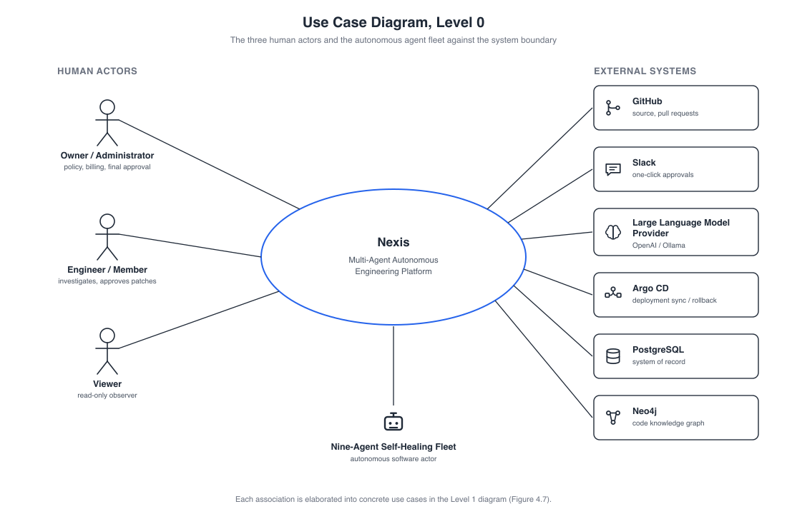{width=74%}

**Figure 4.6: Use Case Diagram, Level 0.** ( the three human actors and the autonomous agent fleet against the system boundary ).

Mediation is the essential property here: every association terminates at the system boundary, and no human ever calls GitHub, the LLM provider, or Argo CD directly. The agents act on the external systems on the humans' behalf instead, surfacing back to a person only at the approval gate.

### 4.6.2 Use Case Diagram, Level 1

Figure 4.7 expands the Level 0 bubble into concrete use cases, grouped by minimum role, where generalisation arrows make the role inheritance explicit.

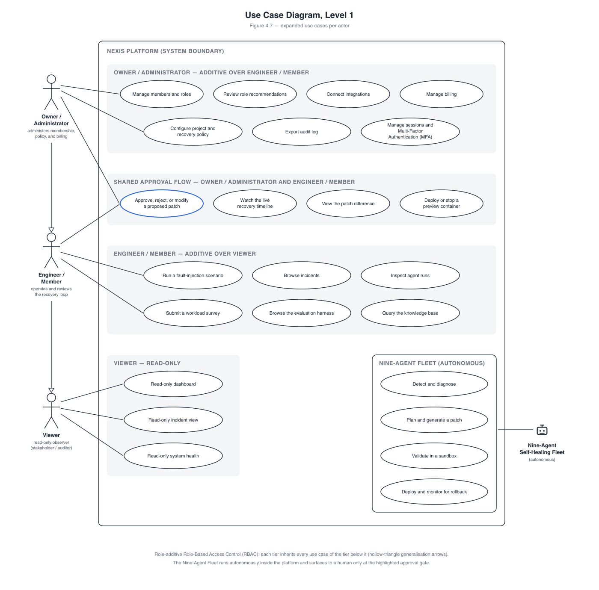{width=74%}

**Figure 4.7: Use Case Diagram, Level 1.** ( expanded use cases per actor ).

The administrative tier holds fifteen use cases in total (membership, role recommendations, integrations, recovery policy and kill switch, billing, the RLHF/JSONL feedback export, audit, MFA). Four approval-flow use cases are shared with the Engineer/Member, whose own tier includes demo scenarios, agent runs, and the NASA-TLX survey [18]; the Viewer holds exactly three read-only use cases. The model is role-additive, in that each tier inherits every use case of the tier below it. As such, the read-only Viewer experience is enforced through RBAC gating in the console, even though the database role enumeration itself is only `owner`/`admin`/`member`.

## 4.7 Data Flow Diagrams

The data view descends in the same way, and it is the view that carries the multi-tenancy argument, since every flow drawn here terminates in a store that Row-Level Security [7] scopes to one organisation. Section 4.7.1 gives the context level, a single process against its three top-level stores; Section 4.7.2 decomposes the administrative surface into ten numbered processes; and Section 4.7.3 decomposes the self-healing loop into twelve, ending at the rollback probe that feeds its own output back into detection.

### 4.7.1 Data Flow Diagram, Level 0 (Context)

At the context level, Figure 4.8 shows the entire platform as a single process 0 with three top-level stores: D1 the tenant database (PostgreSQL, under Row-Level Security), D2 the code graph (Neo4j), and D3 the encrypted patch store (MinIO).

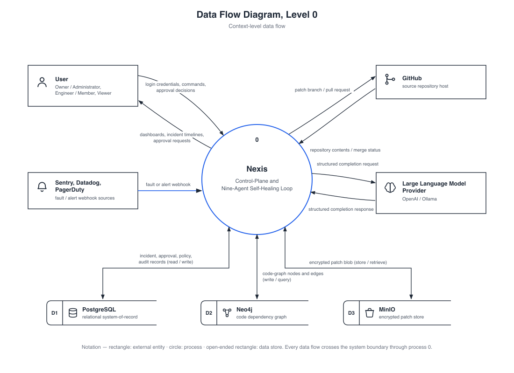{width=74%}

**Figure 4.8: Data Flow Diagram, Level 0.** ( context-level data flow ).

Four entity flows cross the boundary: the user, GitHub, the alert sources (producers of incidents, not consumers), and the LLM provider. Every one of these is mediated by process 0, since there is no direct path from a human to an integration.

### 4.7.2 Data Flow Diagram, Level 1 — Owner/Administrator

Figure 4.9 decomposes the administrative surface into ten numbered processes, spanning identity and access, platform administration, and incident and approval operations, all over the tenant-scoped PostgreSQL stores; Table 4.1 summarises the most essential of these.

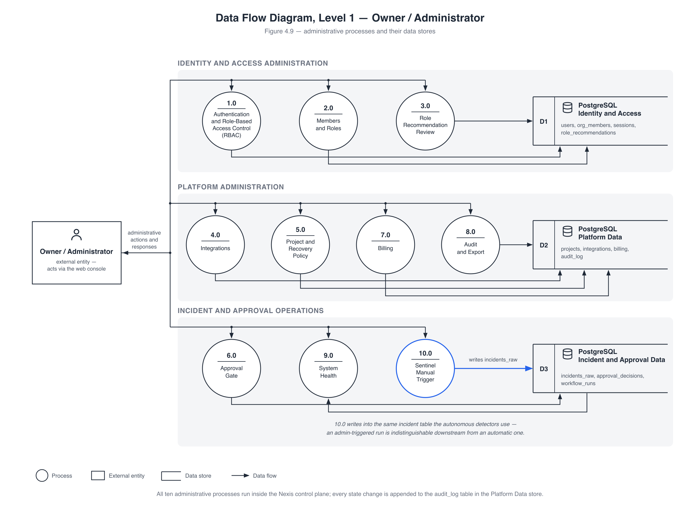{width=74%}

**Figure 4.9: Data Flow Diagram, Level 1 — Owner / Administrator.** ( administrative processes and their data stores ).

**Table 4.1: Owner/Administrator Data Flow Diagram Level 1 processes and their primary data stores.**

| Process | Responsibility | Primary store written |
|---|---|---|
| 1.0 Authentication and RBAC | login, JWT session issue, role checks | `users`, `sessions` |
| 2.0 Members and Roles | invite, promote, demote, remove | `org_members` |
| 3.0 Role Recommendation Review | heuristic promote/downgrade suggestions | `role_recommendations` |
| 4.0 Integrations | connect GitHub / Slack / Sentry / Argo CD | `integrations` |
| 5.0 Project and Recovery Policy | recovery policy, SLO, kill switch | `projects` |
| 6.0 Approval Gate | approve / reject / modify decisions | `approval_decisions` |
| 7.0 Billing | Stripe usage ticker, invoices, plan | billing tables (Stripe) |
| 8.0 Audit and Export | hash-chained audit writes, CSV export | `audit_log` |
| 9.0 System Health | parallel dependency probes (read-only) | — (no persistent write) |
| 10.0 Sentinel Manual Trigger | administrator-initiated detection run | `incidents_raw` |

Processes 1.0 to 3.0 form the identity and membership surface, with 1.0 also binding the request-scoped RLS context and owning session listing, revocation, and TOTP enrolment; 4.0 and 5.0 configure what the autonomous loop is allowed to act on, and 5.0 additionally carries the kill switch that suspends autonomous recovery for a project. Process 9.0 fans probes out to PostgreSQL, Redis, Neo4j, MinIO, and Temporal in parallel and persists nothing at all.

The most important flow, though, is 10.0: a manual detection run writes into the *same* `incidents_raw` table as the automatic detectors, with no separate code path, no parallel queue, and no privileged shortcut, so an administrator-triggered run is indistinguishable downstream from an automatic one. Hence every autonomous-path guarantee — durability, validation, severity routing, auditability — holds for manual runs as well, at no extra engineering cost, and every state change lands in the hash-chained `audit_log`.

### 4.7.3 Data Flow Diagram, Level 1 — Self-Healing Loop

Twelve numbered processes make up the loop in Figure 4.10's decomposition: detection and decision, the Layer-1 execution team, and the validation–approval–deployment–verification tail, spread over five stores (D1 incidents, D2 code graph, D3 patch store, D4 approvals and feedback, D5 deployments and lineage).

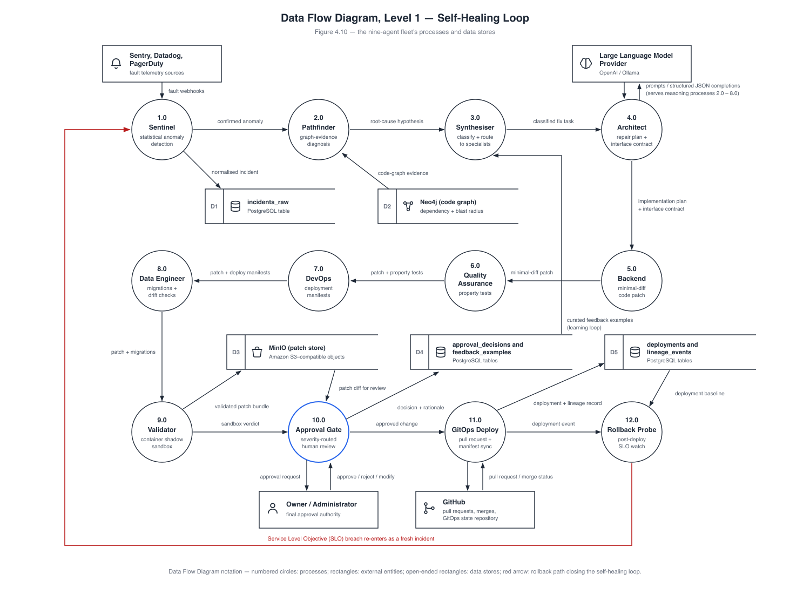{width=74%}

**Figure 4.10: Data Flow Diagram, Level 1 — Self-Healing Loop.** ( the nine-agent fleet's processes and data stores ).

The closing annotation states the property that gives the project its very title: the loop is closed. An SLO breach seen by the rollback probe (12.0) lands in `incidents_raw` as a fresh fatal and re-enters at Sentinel (1.0), with an Argo CD rollback to the prior known-good revision whenever `RollbackOnSLOBreach` is set. Thus, recovery, verification, and re-detection all form one cycle over a single shared data path.

## 4.8 Self-Healing Loop Sequence Diagram

One complete recovery run is traced in Figure 4.11 across all nine agent lifelines, in eighteen numbered messages. Each message is a named Temporal activity, durably recorded and streamed to the incident timeline over Server-Sent Events, in the exact order that the Chapter 5 screenshots show.

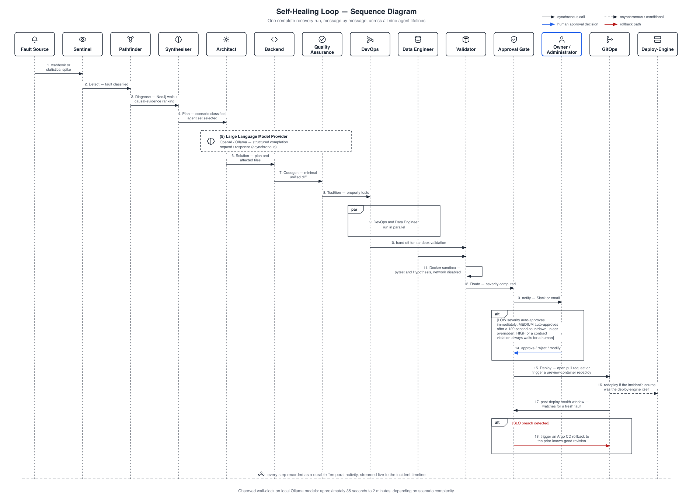{width=74%}

**Figure 4.11: Self-Healing Loop — Sequence Diagram.** ( one complete recovery run, message by message, across all nine agent lifelines ).

No unvalidated patch is allowed past the sandboxed Validator (`--network=none`, `--read-only`, `--cap-drop=ALL`, pytest/Hypothesis suite [9]). Severity routing then forces an explicit human decision for HIGH: schema drift, sensitive-path diffs (`*.sql`, `migrations/`, `auth/`, `security/`, `crypto/`), unknown scenarios, or a contract violation (a diff falling outside the Architect's `affected_files`), whereas LOW auto-approves and MEDIUM auto-approves after 120 seconds. One of the two live runs in Chapter 5 genuinely timed out at this gate, the safety mechanism working as designed. Observed wall-clock time ran from approximately 35 seconds to 2 minutes on local Ollama models, a figure corroborated by Chapter 5's fully successful run of 1 minute 40 seconds.

Taken together, these views describe one coherent design: a mediated boundary, a control-plane serving as the sole gateway to every component and store, a role-additive human surface set beside an autonomous fleet, a single shared data path for both manual and automatic operation, and a recovery cycle that feeds its own failures back into itself. Chapter 5 goes on to present the implementation, while Chapter 6 supplies the evidence that the loop actually closes in practice.
