# Chapter 5: Implementation

The system covered here is the one that actually runs, not a proposed version of it: the technology stack, a screen-by-screen tour of the platform, and the database schema underneath the multi-tenant control plane. Every screenshot is an unretouched capture from the running development environment, and errors or pending states are reported as they happened, not swapped for a tidier run.

## 5.1 Tools and Technology

Nexis is built as a polyglot pnpm + Turborepo monorepo, with each subsystem implemented in whichever language best suits its role:

- **Backend**: Go 1.25 powers four modules: `services/control-plane` (multi-tenant API), `services/validator` (sandboxed patch validation), `services/gitops` (GitHub-App deployment), and `services/deploy-engine` (Docker preview deploys). A Python/FastAPI sidecar, `services/causal-inference` (port 8090), ranks candidate root-cause nodes for the Pathfinder agent, while Temporal [2] durably orchestrates the nine-agent RecoveryPipeline, with every step logged as an ActivityEvent so crashed workers resume in place.
- **Frontend**: Next.js 16, React 19, and TypeScript make up `apps/web`, styled with Tailwind CSS 4 and Radix UI. Monaco handles unified-diff editing, Recharts renders the charts, and Server-Sent Events keep incident pages live without resorting to polling.
- **Data**: PostgreSQL 17 serves as the system of record (Row-Level Security (RLS) [7], 33 migrations); pgvector [19] backs knowledge-base retrieval; Neo4j [3] holds the code dependency graph; Redis handles rate limiting and caching; MinIO stores S3-compatible encrypted patch blobs; and Temporal keeps its own durable event history.
- **AI / LLM**: OpenAI (GPT-4o family) is the production-configured provider, while Ollama [20] (`gpt-oss:20b`, `qwen2.5-coder:14b`) is fully supported; in fact, all live-run evidence in this chapter used Ollama end-to-end, with no cloud Large Language Model (LLM) credentials involved. The Quality Assurance (QA) agent generates Hypothesis [9] property-based tests, which the Validator then executes inside its sandbox. It may be noted that the causal-inference sidecar is a statistical/graph ranking algorithm rather than a fitted DoWhy [4] model, since that would require interventional production data that does not yet exist, a limitation stated openly.
- **DevOps**: Docker API [10] serves both the Validator sandbox and preview deploys and is Podman-compatible [11]; in the evaluation environment, Podman stood in for it and worked identically. Terraform provisions AWS ECS behind a load balancer, OpenTelemetry [5] feeds Prometheus, Loki, Tempo, and Grafana, and Argo CD [6] backs the DevOps agent's Sync/Rollback client.
- **Version control**: Handled via Git and GitHub, with a GitHub App installation supplying short-lived tokens for cloning and for the GitOps blob → tree → commit → ref → Pull Request deployment path.

## 5.2 Project View

The captures that follow are ordered the way a new organisation would encounter the platform: authentication first, then the administrator console, then the self-healing loop itself, which carries the evidentiary weight of the report, followed by the preview-deploy engine and, last, the integration and observability surfaces.

### 5.2.1 Authentication and Onboarding

Access relies on a local JSON Web Token (JWT) session, kept in an HttpOnly cookie, with optional WorkOS [12] Single Sign-On available on top of it. The sign-up screen (Figure 5.1) creates the account and the sign-in screen (Figure 5.2) establishes the session, while the forgot-password flow (Figure 5.3) issues a 32-byte reset token, SHA-256-hashed with a 30-minute time-to-live; it returns the same 202 response regardless of whether the e-mail address actually exists, hence no account information leaks out.

{width=64%}

**Figure 5.1: Sign-Up Screen.** ( new account registration ).

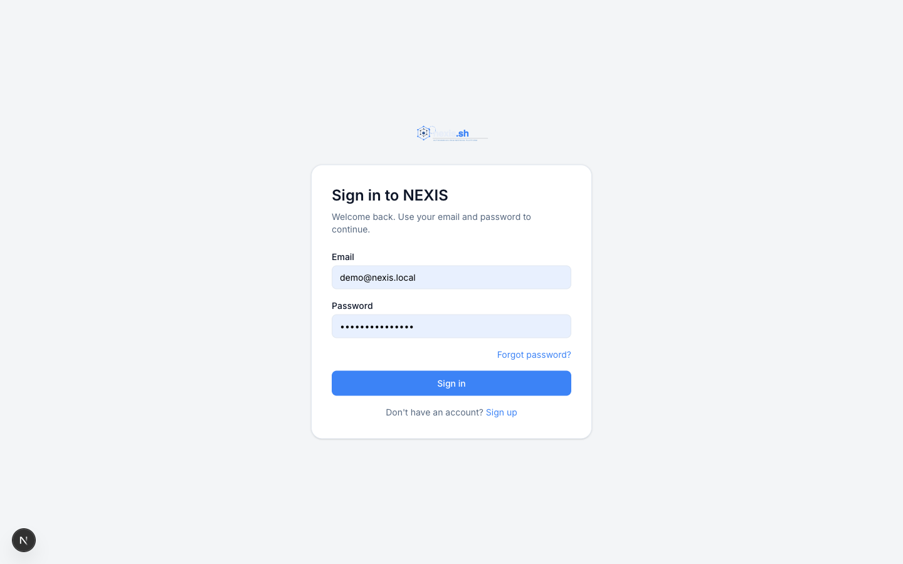{width=64%}

**Figure 5.2: Sign-In Screen.** ( JWT session login with HttpOnly cookie ).

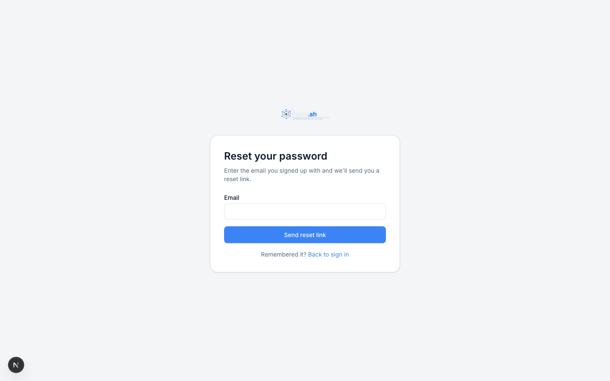{width=64%}

**Figure 5.3: Forgot-Password Screen.** ( non-leaky password-reset request ).

### 5.2.2 Administrator / Owner Console

Once the administrator logs in, the console home (Figure 5.4) presents KPI tiles covering Mean Time To Recovery (MTTR), recovery success rate, open incidents, and mean tokens per run; alongside these sit an incidents-over-time chart, a system status panel, a projects health grid, and an activity feed.

{width=64%}

**Figure 5.4: Administrator Dashboard.** ( KPI tiles, incidents-over-time chart, and system status panel ).

Moving to the Agents page (Figure 5.5), the nine-agent fleet is listed across both layers: the five Execution Team agents (Architect, Backend, QA, DevOps, Data Engineer) and the Self-Healing Loop agents (Sentinel, Pathfinder, Synthesiser, Validator), each with its role and current status. The Workflows page (Figure 5.6) lists RecoveryPipeline executions, every ingested incident appears on the Incidents page (Figure 5.7), and the Activity Stream (Figure 5.8) carries the organisation-wide live event feed that both humans and agents write into.

{width=64%}

**Figure 5.5: Agents Screen.** ( the nine-agent fleet roster across both layers ).

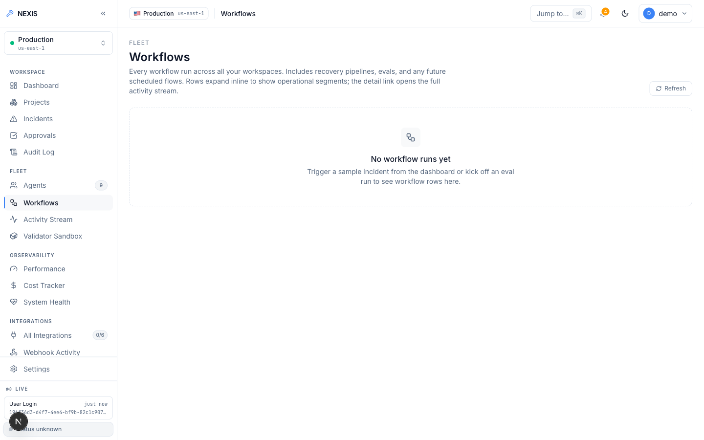{width=64%}

**Figure 5.6: Workflows Screen.** ( RecoveryPipeline run listing ).

{width=64%}

**Figure 5.7: Incidents Screen.** ( the organisation-wide incident list ).

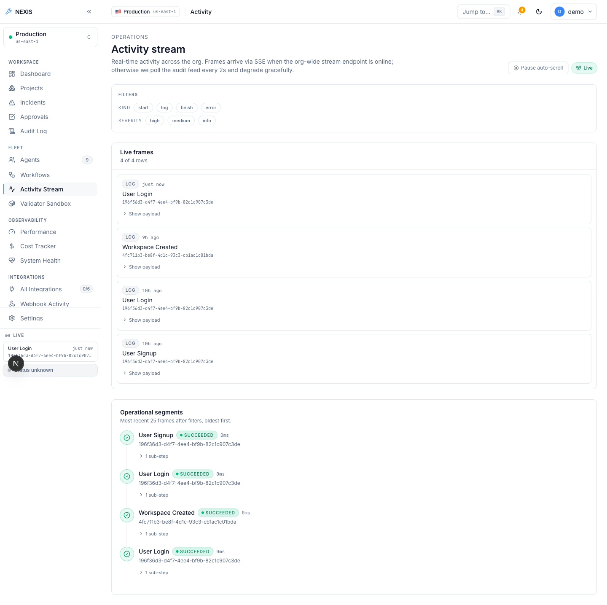{width=64%}

**Figure 5.8: Activity Stream.** ( organisation-wide live event feed ).

Membership is managed under Settings (Figure 5.9), where the `owner` / `admin` / `member` roles sit beside a genuine heuristic role-recommendation panel rather than a mock: three conditions trigger a recommendation — a non-administrator who has logged five or more administrator-gated audit actions in the past 30 days, an administrator dormant for 90 days or more, and an active administrator with no administrator-gated actions at all. Each recommendation states the evidence behind it in plain language; accepting applies the role change under an optimistic-concurrency guard, and dismissing starts a 30-day per-rule cool-down. Sessions (Figure 5.10) are listed with device, IP address, and last-seen time and can be revoked remotely, with the caller's own session badged "This device"; alongside them sit scoped API keys (`nx_live_...`) and Stripe billing [13].

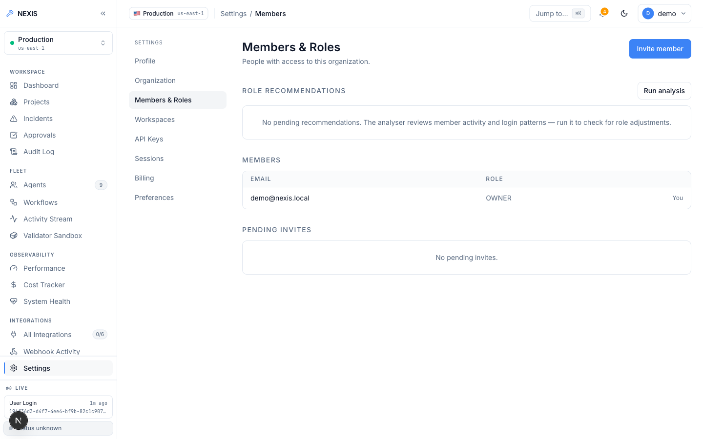{width=64%}

**Figure 5.9: Members Settings.** ( members list with the heuristic role-recommendation panel ).

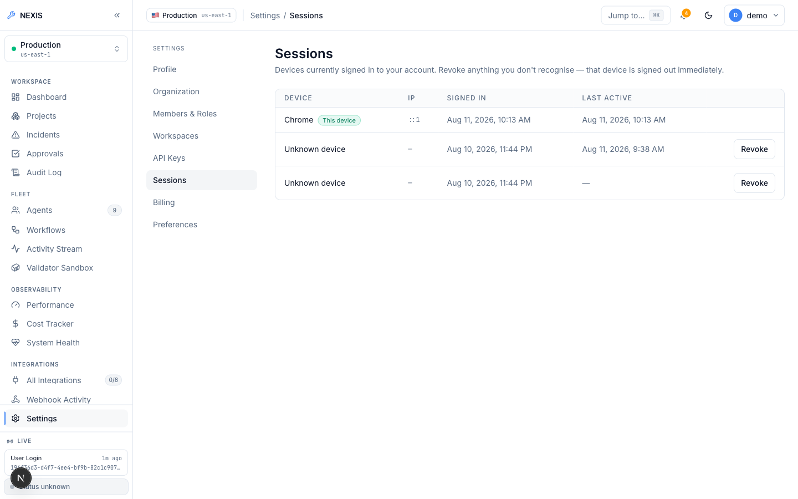{width=64%}

**Figure 5.10: Sessions Settings.** ( active sessions with device, IP, and remote revoke ).

### 5.2.3 Self-Healing Loop — Live Evidence

This subsection carries the evidentiary weight: two real, end-to-end executions of the nine-agent RecoveryPipeline, run against a live local LLM (Ollama, `qwen2.5-coder:14b` and `gpt-oss:20b`), are shown exactly as they occurred, one safely auto-rejected at the approval gate and the other approved and fully succeeded.

Both runs start from the Live Demo console (Figure 5.11), which offers 27 curated fault-scenario cards drawn from a fixture taxonomy spanning application, database, deploy, observability, and security categories. Of those 27, exactly one is wired end-to-end today; the rest are UI-complete but backend-pending, each labelled "Coming soon" in the interface itself. Both runs documented below were triggered through that one wired path, and Figure 5.12 shows the pipeline structure they execute.

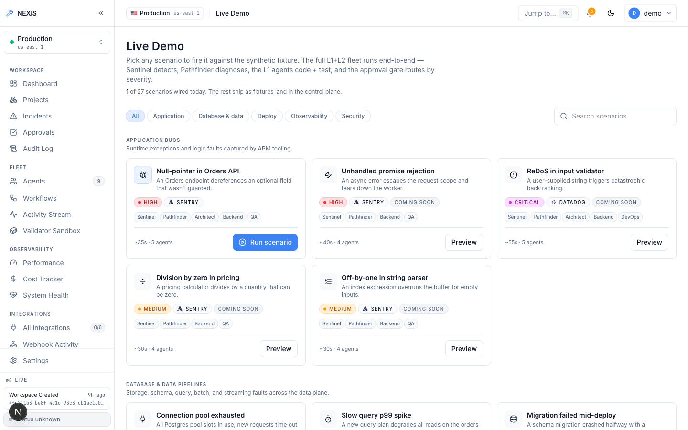{width=64%}

**Figure 5.11: Live Demo Console.** ( 27-scenario fault-injection picker; one scenario fully wired, the rest backend-pending ).

{width=64%}

**Figure 5.12: Recovery Pipeline Screen.** ( the nine-agent pipeline structure ).

Figure 5.13 catches the first run genuinely mid-flight, with Architect, Backend, and QA already completed and showing real, non-zero token counts and costs from actual LLM calls, while DevOps and Data Engineer are still running in parallel. A stubbed pipeline would report zero tokens; consequently, these figures are themselves evidence. A little later in the same run (Figure 5.14), every Layer-1 and Layer-2 step has completed green — patch generated, property-tested, and sandbox-validated — leaving severity at "Medium" and approval at "Pending" inside the 120-second window.

{width=64%}

**Figure 5.13: Incident Detail, Mid-Flight.** ( completed Architect/Backend/QA steps with real token counts; DevOps and Data Engineer running in parallel ).

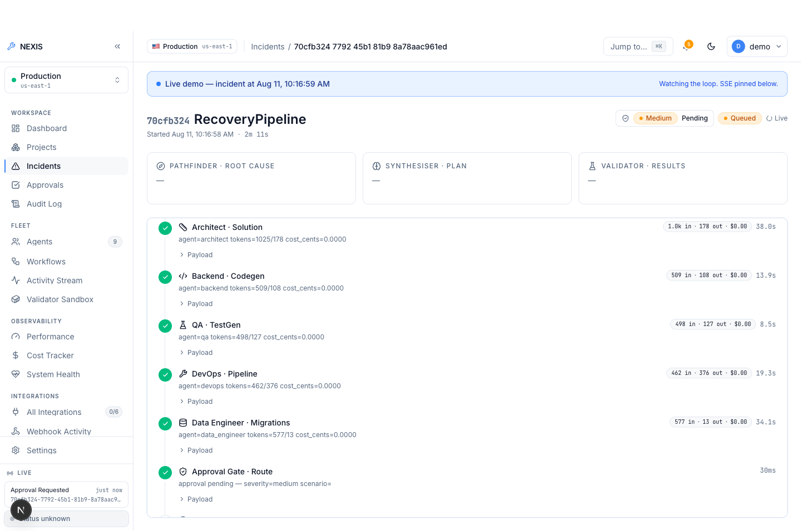{width=64%}

**Figure 5.14: Incident Detail, Pipeline Complete.** ( all Layer-1 and Layer-2 steps green; severity Medium, approval Pending ).

That window elapsed with no decision, and the workflow terminated as `timeout_rejected` (Figure 5.15) — an honest negative result, reported deliberately: absent a human decision, the system refuses to deploy unreviewed code rather than proceeding. A pipeline that silently auto-deployed on timeout would itself be the defect.

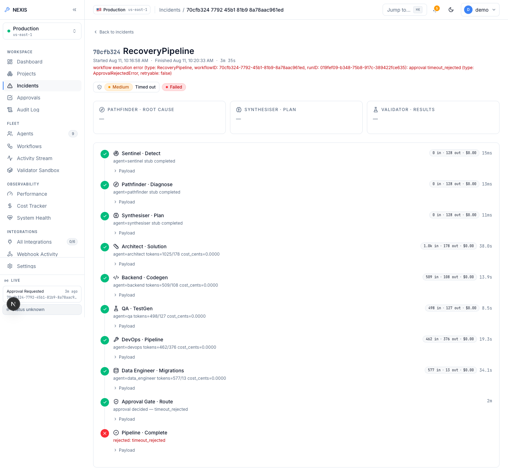{width=64%}

**Figure 5.15: Timeout-Rejected Run.** ( the 120-second approval window elapsed; the workflow safely auto-rejected as `timeout_rejected` rather than deploying unreviewed code ).

The second run supplies the positive counterpart to this result: approved within the window, it records "Medium" severity, "Approved", "Succeeded", and a full nine-step timeline completing in 1 minute 40 seconds, with real per-agent token and cost figures throughout (Figure 5.16). Whether the patch is genuinely model-written is settled by Figure 5.17, the expanded raw JSON of the Backend step: it holds the unified diff produced by `qwen2.5-coder:14b` with `provider="ollama"` recorded in the payload, parsed model output rather than a fixture template.

{width=64%}

**Figure 5.16: Fully Approved Run.** ( Medium severity, Approved, Succeeded; complete nine-step timeline in 1 minute 40 seconds ).

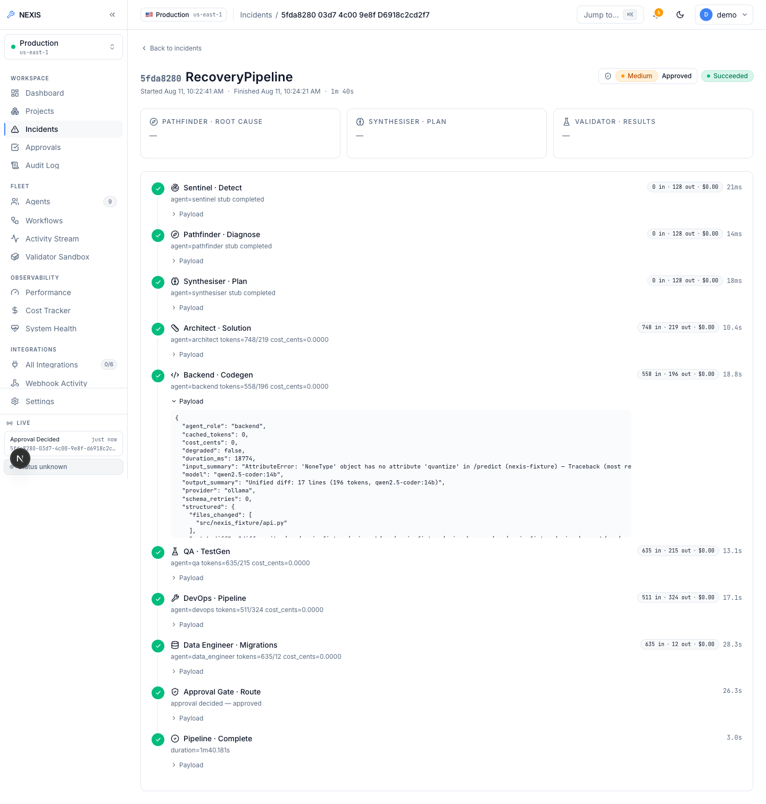{width=64%}

**Figure 5.17: Backend Payload, Expanded.** ( raw JSON evidence of the `qwen2.5-coder:14b`-generated unified diff, provider="ollama" ).

Pending runs surface in the Approvals queue (Figure 5.18), where three human actions are available (Reject, Modify, Approve), each decided in the dialog shown in Figure 5.19. Modify is where the Reinforcement Learning from Human Feedback (RLHF) mechanism becomes concrete: the engineer edits the LLM-generated unified diff inside the embedded editor before approving it (Figure 5.20), and that edited diff, along with every terminal decision, is persisted to `feedback_examples`, feeding a JSONL export for future fine-tuning. Submitting a paid fine-tuning job, however, remains a deliberate manual step rather than an automated one.

{width=64%}

**Figure 5.18: Approvals Queue.** ( real pending approval row with Reject / Modify / Approve actions ).

{width=64%}

**Figure 5.19: Approval Decision Dialog.** ( the Reject / Modify / Approve decision surface for a pending patch ).

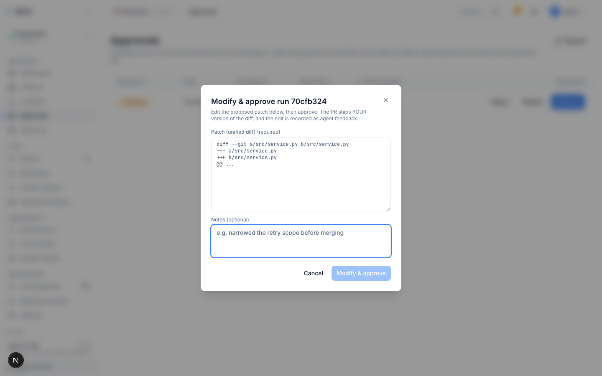{width=64%}

**Figure 5.20: Modify-and-Approve Dialog.** ( RLHF diff editing; the engineer's edit becomes a `feedback_examples` training row ).

Nothing reaches that queue unvalidated. The Validator sandbox console (Figure 5.21) fronts the shadow-execution service in which every candidate patch is run against its QA-generated property tests, inside a container with no network, a read-only filesystem, and all capabilities dropped. Each agent, in turn, has its own detail page; Figure 5.22 shows the Backend agent's configuration and run history.

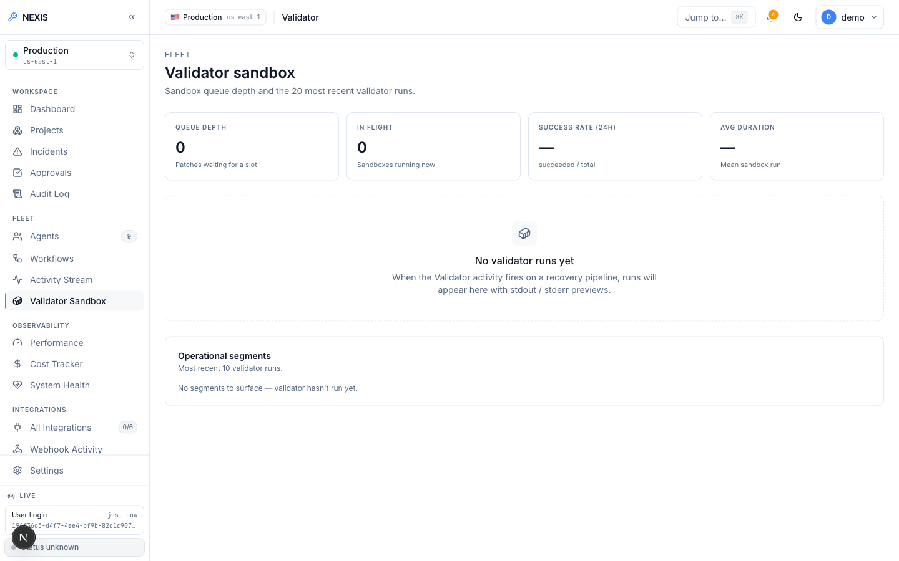{width=64%}

**Figure 5.21: Validator Sandbox Console.** ( sandboxed shadow execution of candidate patches ).

{width=64%}

**Figure 5.22: Agent Detail, Backend Agent.** ( per-agent configuration and run history ).

### 5.2.4 Docker Preview-Deploy Engine (Ops Tab)

Deploy action, live status, preview URL, logs, and history all live on the project's Ops tab, which fronts the preview-deploy engine; Figure 5.23 shows it in its empty state, before any deployment exists. Attempting Deploy on a project with no GitHub App connection (Figure 5.24) returned the real validation error "project has no github repository bound", surfaced verbatim. This is *not* a successful deploy; rather, it is the validation chain correctly rejecting a request it cannot fulfil, and the limitation is environmental (no GitHub App credentials in the evaluation environment) rather than a defect in the engine.

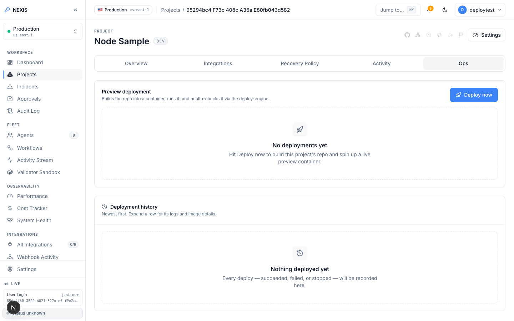{width=64%}

**Figure 5.23: Project Ops Tab, Empty State.** ( the Deploy panel before any deployment ).

{width=64%}

**Figure 5.24: Project Ops Tab, Deploy Attempt.** ( a real validation error — "project has no github repository bound" — returned by the live API ).

Independently of that limitation, the engine was proven live (Listing 5.1): `heroku/node-js-getting-started`, which ships without a Dockerfile, was cloned, detected as Node.js, handed a generated Dockerfile, built, and run under resource limits, and the preview URL served the app's real rendered HTML before a clean stop and removal.

```text
POST /v1/deploy  (repo: heroku/node-js-getting-started, no Dockerfile present)
-> 200 OK
  "status": "running", "dockerfile_source": "generated", "detected_stack": "node",
  "url": "http://localhost:54671", "image_tag": "nexis-preview-test-project:22d06076c357"
  build_log: "...npm ci... EXPOSE 3000... CMD [\"npm\",\"start\"]..."
  container_log: "Listening on 3000\nRendering 'pages/index' for route '/'"

GET http://localhost:54671/  -> real rendered HTML of the Node app (verified)

POST /v1/deploy/test-e2e-001/stop -> {"status":"stopped"}; container removed.
```

**Listing 5.1: Verified live deploy-engine run.**

Per-project self-healing behaviour is configured on the Recovery Policy tab (Figure 5.25), which holds the auto-rollback-on-SLO-breach switch and the kill switch that suspends autonomous recovery entirely. A failed build or a failed health check, meanwhile, inserts a real incident with `source: "deploy_engine"` into the very same Sentinel-to-RecoveryPipeline path used by every other incident source, so a broken build becomes an ordinary self-healing target.

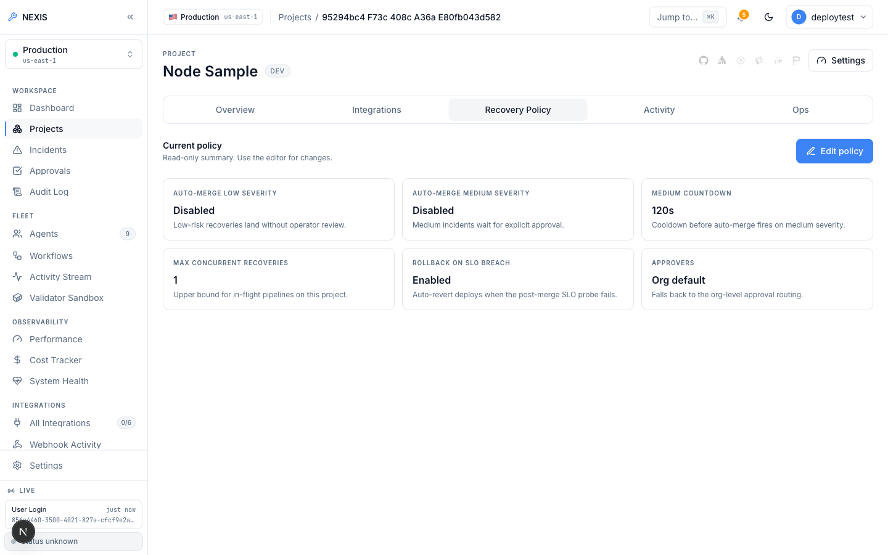{width=64%}

**Figure 5.25: Project Recovery Policy Tab.** ( per-project self-healing configuration ).

### 5.2.5 Integrations and Observability

External providers are managed from the Integrations page (Figure 5.26): the GitHub App (installation, repository listing, webhook-driven incidents on merged pull requests); Sentry [14], Datadog [16], and PagerDuty [15], each a webhook incident source; Slack [17], with OAuth install and one-click approve/reject from a Slack message; Argo CD; and Stripe. Companion pages log webhook deliveries and probe integration health.

{width=64%}

**Figure 5.26: Integrations Screen.** ( provider catalogue: GitHub App, Sentry, Datadog, PagerDuty, Slack, Argo CD, Stripe ).

On the observability side sit performance charts, a per-organisation token cost tracker with a daily budget, and the System Health page (Figure 5.27), which fans out parallel dependency probes against PostgreSQL, Redis, Neo4j, MinIO, and Temporal under a bounded timeout and reports each result independently. The Eval Harness (Figure 5.28) runs side-by-side OpenAI-versus-Ollama comparisons across fixture incidents, persisting transcripts, tracking cost, and offering administrator-only CSV export, while a pgvector-backed knowledge base [19] serves retrieval for the agents.

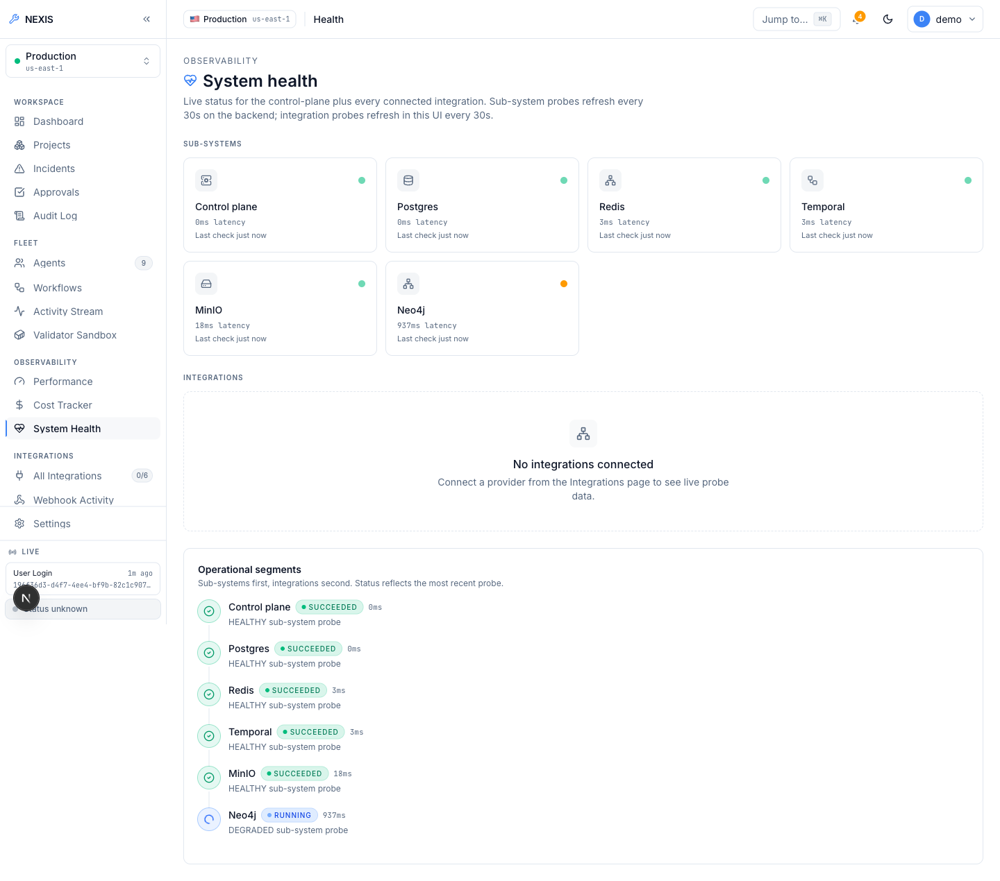{width=64%}

**Figure 5.27: System Health.** ( parallel dependency probes across PostgreSQL, Redis, Neo4j, MinIO, and Temporal ).

{width=64%}

**Figure 5.28: Eval Harness.** ( side-by-side OpenAI-versus-Ollama comparison over fixture incidents ).

Append-only and hash-chained, the Audit Log (Figure 5.29) builds each entry on its predecessor's hash; thus, tampering breaks the chain and becomes detectable through the verify endpoint. CSV export is also available for offline review.

{width=64%}

**Figure 5.29: Audit Log.** ( append-only, hash-chained entries with CSV export ).

## 5.3 Database Schema

State lives in PostgreSQL 17, spread across 33 sequential migrations. Multi-tenancy is enforced at the database level itself: nearly every table carries an organisation identifier, RLS policies [7] restrict queries to the calling organisation's rows, and a request-scoped transaction binds `app.current_org_id`. As such, even a query omitting an organisation `WHERE` clause cannot touch another tenant's data. Two exceptions are deliberate: `users` remains a global identity, with tenancy applied through `org_members`, while `sessions` stays user-scoped — a login session belongs to a person, not a tenant. The most important tenant-scoped tables are set out in Table 5.1.

**Table 5.1: Key tenant-scoped tables in the Nexis PostgreSQL schema.**

| Table | Purpose | RLS scope |
|---|---|---|
| `incidents_raw` | Every ingested fault event, from webhooks, fixtures, and the deploy engine | Organisation-scoped |
| `workflow_runs` | One row per Temporal RecoveryPipeline execution, with per-step activity events | Organisation-scoped |
| `approval_decisions` | Terminal approval-gate outcomes: approve, reject, modify, timeout | Organisation-scoped |
| `feedback_examples` | RLHF training rows persisted from every terminal approval decision | Organisation-scoped |
| `audit_log` | Append-only, hash-chained record of privileged actions | Organisation-scoped |

Neo4j holds the dependency graph that the Pathfinder traverses, MinIO the encrypted patch blobs referenced from `workflow_runs`, and pgvector columns back the knowledge-base retrieval; Temporal's durable event history, moreover, can reconstruct the per-step records in `workflow_runs` in a recovery scenario.
